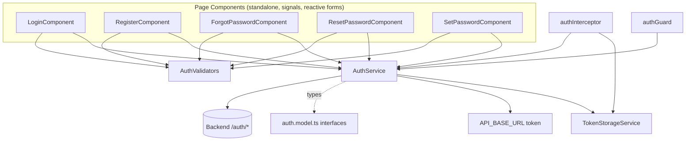
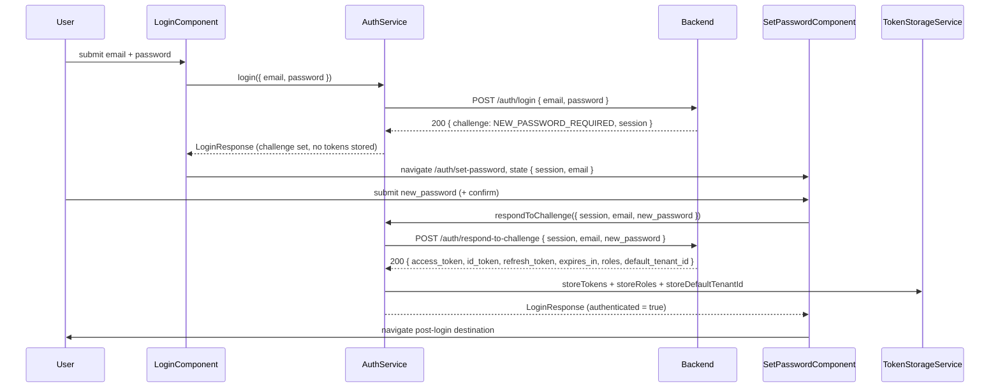

# Design Document

## Overview

This feature reconciles the existing Angular authentication layer (built during the prior `authentication` spec) with the now-finished backend contracts. The frontend already ships with an `AuthService`, `TokenStorageService`, auth models, an `authInterceptor`, an `authGuard`, and page components for login, register, forgot-password, reset-password, and set-password. The wiring was done against assumed contracts that no longer match the real backend.

The work here is primarily **alignment**, not greenfield construction:

- **Login response**: add `default_tenant_id`, persist it through `TokenStorageService`, keep the optional `challenge`/`session` fields.
- **Register request**: add the required `tenant_id` (a UUID) plus a `full_name` field, keep the optional `account_type`. Add UUID and full-name validation in `RegisterComponent`.
- **Error extraction**: switch from the current `error.error?.message || error.error?.detail` extraction to the verified `{ "error": "<message>" }` body shape, with a generic fallback.
- **Recovery + challenge flows**: the backend now exposes `POST /auth/forgot-password`, `POST /auth/confirm-forgot-password`, and `POST /auth/respond-to-challenge` as public endpoints. The `NEW_PASSWORD_REQUIRED` challenge flow (login → set-password → respond-to-challenge) and the reset flow (forgot → email code → reset → login) are in scope and wired end to end.
- **API base URL**: continue constructing every endpoint path from the `API_BASE_URL` injection token, which defaults to `http://localhost:8000` and is overridable without editing `AuthService`.

### Requirements Mapping

| Area | Requirements |
| --- | --- |
| Login request body (`email`, `password` only, no `tenant_id`) + input validation (empty/overlong email, password length) | 1.1–1.5 |
| Login response model + partial-success token persistence + role/tenant persistence + authenticated state | 2.1–2.6 |
| Login challenge model + navigation to set-password | 3.1–3.4 |
| Login error mapping (status→message mapping, 401/403/400/500/connectivity) | 4.1–4.6 |
| Register request model + `tenant_id` UUID + `full_name` validation | 5.1–5.9 |
| Register response model + error mapping (201/409/404/403/400) | 6.1–6.6 |
| Backend error extraction from `{ error }` with malformed-body and missing-field fallback | 7.1–7.4 |
| Token refresh contract (body, update, retain refresh, 401 handling, missing token) | 8.1–8.5 |
| Logout contract (body, clear on success/error, clear on unsendable request, route) | 9.1–9.5 |
| API base URL configuration | 10.1–10.3 |
| Forgot-password flow | 11.1–11.7 |
| Confirm-forgot-password (reset) flow | 12.1–12.8 |
| Respond-to-challenge (set-password) flow | 13.1–13.10 |

## Architecture

The auth layer is a set of standalone Angular pieces wired through DI and `HttpClient`. Nothing in the overall topology changes; the change is in the contracts each piece speaks and the two recovery flows becoming fully functional.



**Responsibilities**

- **AuthService** — owns all `/auth/*` HTTP calls, builds request bodies to match the verified contracts, persists tokens/roles/tenant via `TokenStorageService`, maps error responses to `AuthError`, and holds `isAuthenticated` / `userRoles` / `isLoading` signals.
- **TokenStorageService** — persists the `TokenPair`, `roles`, `default_tenant_id`, and return URL in `localStorage`. Gains a tenant-id slot.
- **auth.model.ts** — the request/response interfaces that encode the contracts.
- **AuthValidators** — email (≤254), password (8–72), match-field, non-blank required; gains a UUID validator and a bounded full-name check.
- **authInterceptor** — attaches bearer tokens to non-auth requests, refreshes on 401, redirects on refresh failure. Already excludes `/auth/*`; no contract change needed.
- **authGuard** — reads `AuthService.isAuthenticated()`; unchanged.
- **API_BASE_URL** — injection token, default `http://localhost:8000`, overridable via provider without touching `AuthService`.

### Challenge flow (login → NEW_PASSWORD_REQUIRED → set-password → respond-to-challenge)



### Password reset flow (forgot → email code → reset → login)

```mermaid
sequenceDiagram
  participant U as User
  participant FP as ForgotPasswordComponent
  participant AS as AuthService
  participant BE as Backend
  participant RSP as ResetPasswordComponent

  U->>FP: submit email
  FP->>AS: forgotPassword(email)
  AS->>BE: POST /auth/forgot-password { email }
  BE-->>AS: success (enumeration-safe)
  AS-->>FP: void
  FP->>RSP: navigate /auth/reset-password, state { email }; show generic confirmation
  Note over U: receives Reset_Code by email
  U->>RSP: submit code + new_password (+ confirm)
  RSP->>AS: confirmForgotPassword({ email, code, new_password })
  AS->>BE: POST /auth/confirm-forgot-password { email, code, new_password }
  BE-->>AS: success
  AS-->>RSP: void
  RSP->>U: navigate /auth/login, show success message
```

## Components and Interfaces

### AuthService (`src/app/core/services/auth.service.ts`)

Concrete changes, method by method:

- **`login(credentials: LoginRequest)`** — body stays exactly `{ email, password }` (Req 1.1, 1.2). On a 200 without `challenge`, persist tokens, roles, and now `default_tenant_id`, then set `isAuthenticated` true (Req 2.2, 2.4, 2.5, 2.6). Token persistence is **partial-success tolerant**: each token value is written through the TokenStorageService independently, and a failure writing any single value does not abort the remaining writes and does not turn a successful 200 login into a failure — the login proceeds with whatever tokens were stored successfully (Req 2.3). On a `challenge` response, store nothing and return the response so `LoginComponent` can route (Req 3.2, 3.3).
- **`register(data: RegisterRequest)`** — body must include `email`, `password`, `full_name`, `tenant_id`, and, when provided, `account_type` (Req 5.2, 5.9). No behavioral change beyond the model widening; error mapping handled in the component.
- **`refreshToken()`** — body stays `{ refresh_token }` (Req 8.1). On 200 update `access_token`/`id_token`/`expires_in` and retain the existing `refresh_token` (Req 8.2, 8.3). On 401 clear all state and route to login (Req 8.4). Add a guard: when no refresh token is stored, short-circuit to an auth failure and route to login rather than calling the backend with `null` (Req 8.5).
- **`logout()`** — body `{ access_token }` (Req 9.1); clear all state on 204 or any error and route to login (Req 9.2, 9.3, 9.5). The clearing runs in a `finalize` block so it happens on every terminal outcome. This also covers the case where the logout request cannot be dispatched at all (a synchronous send failure): local state is cleared and the user is routed to login regardless of whether the POST ever left the client (Req 9.4). Current implementation already clears via `finalize`; keep it and ensure the send-failure path also flows through the same finalize-based clearing.
- **`forgotPassword(email)`** — body exactly `{ email }` (Req 11.1); connectivity errors surface as status 0 (Req 11.7).
- **`confirmForgotPassword(data)`** — body exactly `{ email, code, new_password }` (Req 12.1).
- **`respondToChallenge(data)`** — body exactly `{ session, email, new_password }` (Req 13.5); on success persist tokens + roles and set authenticated true (Req 13.6, 13.7); connectivity errors surface as status 0 (Req 13.10).

**Error mapping (`handleError`)** — the current extraction reads `error.error?.message || error.error?.detail`. Replace with extraction from the verified `{ "error": "<message>" }` shape (Req 7.1–7.4):

```typescript
private handleError(error: HttpErrorResponse): Observable<never> {
  if (error.status === 0) {
    return throwError(() => ({
      statusCode: 0,
      message: 'Unable to connect. Check your internet connection.',
    } as AuthError));
  }

  // Attempt extraction from the Error_Body `error` field (Req 7.1).
  // A body may be present but malformed/corrupted (e.g. a string, a number,
  // or an object whose `error` is not a readable string); guard the read so a
  // failed extraction falls through to the generic fallback rather than throwing.
  let backendMessage: string | undefined;
  try {
    backendMessage =
      typeof error.error?.error === 'string' ? error.error.error : undefined;
  } catch {
    backendMessage = undefined;
  }

  return throwError(() => ({
    statusCode: error.status,
    message: backendMessage ?? 'An unexpected error occurred. Please try again.',
    error: backendMessage,
  } as AuthError));
}
```

Both `message` and `error` are populated from the single `error` field when a readable value is present (Req 7.1, 7.4). When an Error_Body is present but malformed/corrupted such that the `error` field cannot be read, or when there is no readable `error` field at all, the extraction yields `undefined` and the generic fallback message is used (Req 7.2, 7.3).

### TokenStorageService (`src/app/core/services/token-storage.service.ts`)

Add persistence for `default_tenant_id` (Req 2.4) alongside the existing token/roles/return-url slots:

```typescript
private readonly TENANT_KEY = 'sora-sport-default-tenant-id';

storeDefaultTenantId(tenantId: string): void {
  localStorage.setItem(this.TENANT_KEY, tenantId);
}

getDefaultTenantId(): string | null {
  return localStorage.getItem(this.TENANT_KEY);
}

clearDefaultTenantId(): void {
  localStorage.removeItem(this.TENANT_KEY);
}
```

`clearAll()` also clears the tenant id so logout and refresh-failure leave no stale tenant behind.

### LoginComponent (`src/app/features/auth/login/login.component.ts`)

Already navigates to `/auth/set-password` with `state: { session, email }` on `NEW_PASSWORD_REQUIRED`, and to the return URL / `/feed` otherwise (Req 3.2–3.4). Verify the email validators block submission when the email is empty (Req 1.4) or exceeds 254 characters (Req 1.3), and the password validator blocks submission when the password is outside 8–72 characters (Req 1.5). Confirm the 401/403/400/500 branches in `mapError` implement the strict-but-satisfiable status→message mapping (Req 4.1) and cover 401 (Req 4.2), 403 (Req 4.3), 400 (Req 4.4), and 500 (Req 4.5); the connectivity message (status 0) falls through to the default branch using the `AuthError.message` (Req 4.6).

### RegisterComponent (`src/app/features/auth/register/register.component.ts`)

Add a `tenant_id` control with a UUID validator and a `full_name` control that is both required and bounded; include both in the submitted payload (Req 5.1–5.9). The current form omits `tenant_id` and `full_name`, so this is the largest component change:

```typescript
readonly form = this.fb.nonNullable.group({
  email: ['', [AuthValidators.required(), AuthValidators.email()]],
  full_name: ['', [
    AuthValidators.required(),          // empty full_name blocked (Req 5.5)
    AuthValidators.nonBlank(),          // whitespace-only non-empty blocked (Req 5.6)
    AuthValidators.maxLength(200),      // >200 characters blocked (Req 5.6)
  ]],
  tenant_id: ['', [AuthValidators.required(), AuthValidators.uuid()]],
  password: ['', [AuthValidators.required(), AuthValidators.password()]],
  confirmPassword: ['', [AuthValidators.required(), AuthValidators.matchField('password')]],
  account_type: [''],
});
```

The `full_name` rules split into two concerns: a plain `required()` covers the empty case (Req 5.5), while `nonBlank()` + `maxLength(200)` cover the whitespace-only-non-empty and over-200-character cases (Req 5.6). The `email` validator also blocks submission when the email exceeds 254 characters (Req 5.7), and the `password` validator blocks submission outside 8–72 characters (Req 5.8). Payload builds `{ email, password, full_name, tenant_id, ...(account_type ? { account_type } : {}) }`. `mapError` gains a 404 branch (tenant not found) alongside the existing 409/403/400 branches (Req 6.3–6.6), and the success branch shows a message on 201 (Req 6.2).

### ForgotPasswordComponent

Sends `{ email }` (Req 11.1), blocks blank/overlong (>254) email with a validation message (Req 11.2), and blocks submission on an invalid email regardless of whether a validation message is displayed — the block is enforced independently of the message-display path (Req 11.3). On success it navigates to reset-password carrying `state: { email }` (Req 11.4) and shows a generic enumeration-safe confirmation that does not reveal whether the email is associated with an account (Req 11.5). On an error response the message is derived from the `{ error }` body, and showing that error concurrently with navigation to the ResetPasswordPage is acceptable (Req 11.6); connectivity failures surface as status 0 (Req 11.7). The visible confirmation stays generic to avoid enumeration.

### ResetPasswordComponent

Sends `{ email, code, new_password }` (Req 12.1), requires a non-blank code (Req 12.2), an 8–72 password (Req 12.4), and a matching confirmation (Req 12.5). Client-side validation is enforced as a hard gate: when validation fails the request is blocked such that no `POST` is dispatched to the ConfirmForgotPassword_Endpoint (Req 12.3). On success navigates to `/auth/login` with a success message, even if form validation errors were bypassed (Req 12.6). On error, show a message derived from the `{ error }` body — the current hard-coded Spanish string should be replaced with the mapped `AuthError.message`, distinguishing invalid/expired code where the backend says so (Req 12.7) from any other error (Req 12.8).

### SetPasswordComponent

Retains `session` + `email` from `history.state` (Req 13.1), validates password 8–72 (Req 13.2) and confirmation match (Req 13.3). When password validation fails, submission is blocked at the UI level by disabling the submit control or preventing the form submission (Req 13.4). On submit it calls `respondToChallenge` with `{ session, email, new_password }` (Req 13.5); on success the service persists tokens/expires_in (Req 13.6) and roles + authenticated state (Req 13.7), and the component navigates to the post-login destination (Req 13.8). On error shows the `{ error }`-derived message (Req 13.9), and connectivity failures surface as status 0 (Req 13.10). Already redirects to login when the session/email context is missing.

### AuthValidators (`src/app/core/validators/auth.validators.ts`)

Add validators:

- **`uuid()`** — rejects any value that is not a canonical UUID (8-4-4-4-12 hex, RFC 4122 layout). Returns `{ uuid: { message } }` on failure (Req 5.4).
- **`maxLength(max)`** — rejects values whose trimmed length exceeds `max`; used for `full_name` ≤200 (Req 5.6).
- **`nonBlank()`** — rejects a non-empty value composed solely of whitespace; used alongside `maxLength(200)` for `full_name` (Req 5.6). The plain `required()` continues to cover the empty case (Req 5.5).

### API_BASE_URL (`src/app/core/config/api.config.ts`)

Unchanged in shape: an `InjectionToken<string>` with `factory: () => 'http://localhost:8000'` (Req 10.2), consumed by `AuthService` for every path (Req 10.1), overridable by providing the token in a config without editing `AuthService` (Req 10.3).

## Data Models

All interfaces live in `src/app/core/models/auth.model.ts`. Bold entries are the additions/changes.

```typescript
export interface TokenPair {
  access_token: string;
  id_token: string;
  refresh_token: string;
  expires_in: number;
}

export interface LoginRequest {
  email: string;
  password: string;
}

export interface LoginResponse {
  access_token: string;
  id_token: string;
  refresh_token: string;
  expires_in: number;
  default_tenant_id: string;   // ADDED (Req 2.1)
  roles: string[];
  challenge?: 'NEW_PASSWORD_REQUIRED'; // optional (Req 3.1)
  session?: string;                    // optional (Req 3.1)
}

export interface RegisterRequest {
  email: string;
  password: string;
  full_name: string;   // ADDED (Req 5.1)
  tenant_id: string;   // ADDED, required UUID (Req 5.1)
  account_type?: string;
}

export interface RegisterResponse {
  user_id: string;
  email: string;
  full_name: string;   // ADDED (Req 6.1)
  status: string;
  message: string;
}

export interface ConfirmForgotPasswordRequest {
  email: string;
  code: string;
  new_password: string;
}

export interface ChallengeResponse {
  session: string;
  email: string;
  new_password: string;
}

export interface RefreshResponse {
  access_token: string;
  id_token: string;
  expires_in: number;
}

export interface AuthError {
  statusCode: number;
  message: string;
  error?: string;
}
```

Notes:
- `LoginResponse.default_tenant_id` is required on the success shape; on a challenge response the backend returns `challenge` + `session` and no tokens, so `AuthService.login` only reads token/tenant fields on the non-challenge branch.
- `respondToChallenge` returns a `LoginResponse`-shaped success payload, so the same persistence logic applies.
- The backend `Error_Body` is modeled inline as `{ error: string }`; only the `error` field is read.

## Correctness Properties

*A property is a characteristic or behavior that should hold true across all valid executions of a system — essentially, a formal statement about what the system should do. Properties serve as the bridge between human-readable specifications and machine-verifiable correctness guarantees.*

These properties were derived from the acceptance criteria after prework classification and redundancy reflection. Deterministic status→message mappings, static type declarations, and one-off navigation flows are covered by example/edge-case unit tests (see Testing Strategy) rather than properties.

### Property 1: Login request body carries exactly email and password

*For any* email and password strings, the body of the `POST /auth/login` request issued by `AuthService.login` has a key set exactly equal to `{ "email", "password" }` — never including `tenant_id` or any other field.

**Validates: Requirements 1.1, 1.2**

### Property 2: Email length validation boundary

*For any* string, `AuthValidators.email` returns a validation error when the string length exceeds 254 characters and (for otherwise well-formed addresses) does not flag a length error at 254 or below.

**Validates: Requirements 1.3, 5.7, 11.2**

### Property 3: Password length validation boundary

*For any* string, `AuthValidators.password` returns an error when its length is below 8 or above 72, and returns no error when its length is within 8–72 inclusive.

**Validates: Requirements 1.5, 5.8, 12.4, 13.2**

### Property 4: Login success persists session and authenticates

*For any* login response that omits a `challenge`, after `AuthService.login` completes the stored `TokenPair` equals the response's `access_token`/`id_token`/`refresh_token`/`expires_in`, the stored roles equal `response.roles`, the persisted default tenant equals `response.default_tenant_id`, and `isAuthenticated()` is `true`.

**Validates: Requirements 2.2, 2.4, 2.5, 2.6, 3.2**

> Partial-success token storage (Req 2.3) — that a single storage write failure does not abort the remaining writes and does not fail the login — is a specific fault-injection scenario best covered by an example/unit test (see Testing Strategy) rather than folded into this all-successful-write property.

### Property 5: Login challenge neither persists nor authenticates

*For any* login response that includes a `NEW_PASSWORD_REQUIRED` challenge (and a session), after `AuthService.login` completes no tokens, roles, or tenant id are written to storage and `isAuthenticated()` remains `false`.

**Validates: Requirements 3.3, 3.4**

### Property 6: Error message is extracted from the Error_Body `error` field

*For any* non-zero HTTP status and any string message, when `AuthService` receives an error whose body is `{ error: message }`, the resulting `AuthError` has `message` and `error` both equal to that message.

**Validates: Requirements 7.1, 7.4, 11.6, 12.7, 12.8, 13.9**

### Property 7: Missing readable error yields the generic fallback

*For any* error body that lacks a readable string `error` field — whether the field is absent, null, or non-string, or the body itself is malformed/corrupted such that the field cannot be read — the resulting `AuthError.message` equals the generic fallback message.

**Validates: Requirements 7.2, 7.3**

> The malformed/corrupted-body fallback (Req 7.2) is additionally exercised by a targeted example/unit test feeding intentionally malformed bodies (see Testing Strategy), since crafting "corrupted" shapes is clearer as concrete examples than as a generator.

### Property 8: Connectivity failure yields status 0

*For any* auth endpoint call that fails with an `HttpErrorResponse` of status 0, the resulting `AuthError` has `statusCode` 0 and the connectivity message, regardless of which endpoint or inputs were used.

**Validates: Requirements 4.6, 11.7, 13.10**

### Property 9: UUID validation acceptance and rejection

*For any* canonical UUID string, `AuthValidators.uuid` returns no error; *for any* string that does not match the canonical UUID layout, it returns a validation error.

**Validates: Requirements 5.4**

### Property 10: Full-name length validation boundary

*For any* string, the register `full_name` validation errors when the value is empty, when it is a non-empty whitespace-only value, or when it is longer than 200 characters, and passes when the trimmed length is between 1 and 200 inclusive.

**Validates: Requirements 5.5, 5.6**

### Property 11: Non-blank required validation

*For any* string composed solely of whitespace (or empty), `AuthValidators.required` returns an error; *for any* string with at least one non-whitespace character, it returns no error.

**Validates: Requirements 12.2**

### Property 12: Password confirmation match

*For any* pair of strings, `AuthValidators.matchField` returns no error exactly when the two values are equal, and returns an error otherwise.

**Validates: Requirements 12.5, 13.3**

### Property 13: Challenge response success persists session and authenticates

*For any* success response returned by `respondToChallenge`, after the call completes the stored tokens equal the response tokens, stored roles equal `response.roles`, and `isAuthenticated()` is `true`.

**Validates: Requirements 13.6, 13.7**

### Property 14: Refresh request body carries the stored refresh token

*For any* refresh token persisted in storage, the body of the `POST /auth/refresh` request equals `{ refresh_token: <stored value> }`.

**Validates: Requirements 8.1**

### Property 15: Refresh updates rotating tokens and retains the refresh token

*For any* pre-existing stored refresh token and any 200 `RefreshResponse`, after `refreshToken` completes the stored `access_token`/`id_token`/`expires_in` equal the response values and the stored `refresh_token` equals the original pre-existing value.

**Validates: Requirements 8.2, 8.3**

### Property 16: Logout request body carries the stored access token

*For any* access token persisted in storage, the body of the `POST /auth/logout` request equals `{ access_token: <stored value> }`.

**Validates: Requirements 9.1**

### Property 17: Logout always clears state and routes to login

*For any* logout backend outcome (a 204 or any error status), after `logout` completes all stored authentication state is cleared and the router is navigated to `/auth/login`.

**Validates: Requirements 9.2, 9.3, 9.5**

> The unsendable-request case (Req 9.4) — logout completes locally and routes to login when the POST cannot be dispatched at all — is a synchronous send-failure scenario best covered by an example/unit test (see Testing Strategy), since it is a specific fault-injection path rather than a per-input universal.

### Property 18: Every endpoint path is built from the configured base URL

*For any* configured `API_BASE_URL` value, each `AuthService` call issues its request to `${base}/auth/<path>` for the corresponding endpoint path.

**Validates: Requirements 10.1**

### Property 19: Register request body carries required fields and conditional account_type

*For any* valid register input, the `POST /auth/register` body includes `email`, `password`, `full_name`, and `tenant_id`; and the `account_type` key is present exactly when a non-empty `account_type` was provided.

**Validates: Requirements 5.2, 5.9**

### Property 20: Forgot-password request body carries exactly email

*For any* email string, the body of the `POST /auth/forgot-password` request has a key set exactly equal to `{ "email" }`.

**Validates: Requirements 11.1**

### Property 21: Confirm-forgot-password request body carries exactly email, code, new_password

*For any* email, code, and new_password strings, the body of the `POST /auth/confirm-forgot-password` request has a key set exactly equal to `{ "email", "code", "new_password" }`.

**Validates: Requirements 12.1**

### Property 22: Respond-to-challenge request body carries exactly session, email, new_password

*For any* session, email, and new_password strings, the body of the `POST /auth/respond-to-challenge` request has a key set exactly equal to `{ "session", "email", "new_password" }`.

**Validates: Requirements 13.5**

## Error Handling

Error handling is centralized in `AuthService.handleError`, which every HTTP method pipes through `catchError`. Components then translate the resulting `AuthError` into user-facing (Spanish) copy.

**Service-level normalization (`handleError`)**

| Condition | `AuthError` produced |
| --- | --- |
| `status === 0` (unreachable backend) | `{ statusCode: 0, message: 'Unable to connect. Check your internet connection.' }` (Req 4.6, 11.7, 13.10) |
| Body is `{ error: msg }` (string) | `{ statusCode, message: msg, error: msg }` (Req 7.1, 7.4) |
| Body present but malformed/corrupted, `error` unreadable | `{ statusCode, message: <generic fallback> }` (Req 7.2) |
| Body lacks a readable string `error` | `{ statusCode, message: <generic fallback> }` (Req 7.3) |

**Component-level mapping (status → message)**

- **Login** (Req 4.1–4.5): the status→message mapping is strict-but-satisfiable so each status maps to its designated message (Req 4.1); 401 → invalid credentials (Req 4.2); 403 → account not active (Req 4.3); 400 → validation message from `AuthError.message` (Req 4.4); 500/other → generic (Req 4.5). Status 0 falls through to the generic branch using the connectivity `message` (Req 4.6).
- **Register** (Req 6.3–6.6): 409 → email already registered; 404 → tenant not found; 403 → registration not permitted; 400 → validation message from `AuthError.message`; other → generic.
- **Forgot-password** (Req 11.5, 11.6): always shows a generic enumeration-safe confirmation on success; on error shows a message derived from the `{ error }` body without confirming account existence, which may display concurrently with navigation to the ResetPasswordPage.
- **Reset-password** (Req 12.7, 12.8): invalid/expired code and other errors both surface the `{ error }`-derived message; the current hard-coded string is replaced by `AuthError.message`.
- **Set-password** (Req 13.9): shows `AuthError.message` from the `{ error }` body.

**Refresh and logout special cases**

- Refresh 401 (Req 8.4) and missing-refresh-token (Req 8.5): clear all state via `TokenStorageService.clearAll()`, reset `isAuthenticated`/`userRoles`, and route to `/auth/login`. The missing-token case short-circuits before any HTTP call.
- Logout (Req 9.2, 9.3, 9.5): clears all state and routes to login on both 204 and any error, using `finalize`. The same finalize-based clearing also handles a request that cannot be dispatched at all (synchronous send failure), so local state is cleared and the user is routed to login even when the POST never leaves the client (Req 9.4).

## Testing Strategy

Tests run under the existing Jasmine + Karma toolchain (`ng test`). `fast-check` (^4.9.0) is already a dev dependency and is used for the property-based tests. HTTP is exercised with `HttpClientTestingModule` / `HttpTestingController` so request bodies and URLs can be asserted, and `localStorage` is used directly (or cleared between specs) for storage round-trips.

**Dual approach**

- **Property-based tests** cover the 22 correctness properties above — request-body shape, error extraction, storage round-trips, validators, and base-URL composition — where behavior varies meaningfully with input.
- **Unit (example/edge) tests** cover deterministic status→message mappings (Req 4.1–4.5, 6.2–6.6), navigation flows (Req 3.2/3.3 component nav, 11.4, 12.6, 13.8), state carry-through (Req 13.1), the client-side submission gates (Req 11.3 forgot-password invalid-email block, 12.3 reset no-POST-on-invalid, 13.4 set-password UI block), the missing-refresh-token edge case (Req 8.5), the default base URL (Req 10.2), and DI override (Req 10.3). Static type declarations (Req 2.1, 3.1, 5.1, 6.1) are enforced at compile time.
- **Fault-injection example tests** cover the new resilience behaviors that are not per-input universals: partial-success token storage on login (Req 2.3, a single storage write throwing must not fail the login or abort the other writes), logout completing locally and routing to login when the request cannot be sent (Req 9.4), and the malformed/corrupted Error_Body falling back to the generic message (Req 7.2).

**Property-based test rules**

- Use `fast-check` — do not hand-roll generators or a PBT harness.
- Each property test runs a minimum of 100 iterations (`fc.assert(fc.property(...), { numRuns: 100 })`).
- Each property test is tagged with a comment referencing its design property, in the format: `// Feature: auth-backend-integration, Property {number}: {property_text}`.
- Each correctness property is implemented by a single property-based test.

**Generators / notable techniques**

- Emails and passwords: `fc.string` with length constraints to hit boundaries (e.g., lengths spanning 0–300 for the email 254 boundary, 0–100 for the 8–72 password boundary).
- UUIDs: `fc.uuid()` for the acceptance side of Property 9; arbitrary strings filtered to the non-UUID set for the rejection side.
- Login/refresh/challenge responses: record generators producing token/role/tenant fields, with a boolean toggling the `challenge` branch for Properties 4 and 5.
- Request-body assertions: capture the outgoing request via `HttpTestingController.expectOne` and assert `Object.keys(req.request.body).sort()` for the exact-key properties.
- Error extraction: generate arbitrary status codes (excluding 0) and message strings for Property 6, and bodies without a string `error` for Property 7.

**Unit test focus areas**

- Component `mapError` functions for each status branch.
- Router navigation assertions using a `Router` spy for challenge, reset, and post-login redirects.
- `TokenStorageService` tenant-id slot and `clearAll` behavior.
- Interceptor behavior is already covered by existing specs and is unaffected by this contract alignment.
