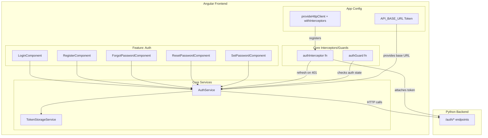
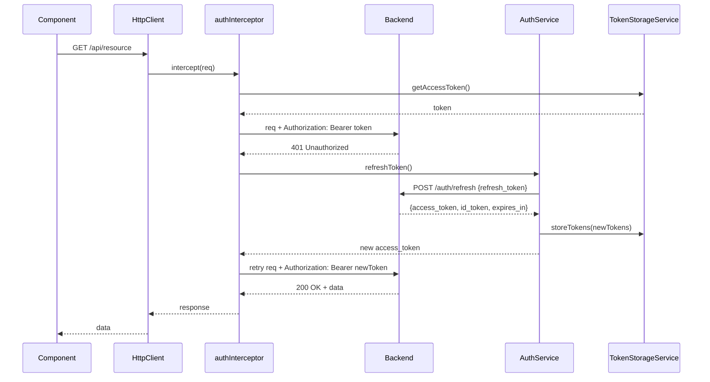

# Design Document: Authentication

## Overview

This design specifies the authentication system for the Sora Sport Angular 22 frontend application. The system provides login, self-registration, forgot/reset password, invited-user password setup, token management with auto-refresh, logout, and route protection. All authentication operations delegate to a Python backend that integrates with AWS Cognito.

The implementation replaces the existing mock `AuthService` and UI-only login/register components with a production-ready authentication layer using Angular's reactive patterns (signals), functional HTTP interceptors, and functional route guards.

### Key Design Decisions

1. **Reactive state with signals**: The `AuthService` uses Angular signals for authentication state (tokens, roles, isAuthenticated), enabling fine-grained change detection without RxJS BehaviorSubjects for state.
2. **Functional interceptor**: Uses Angular's modern `HttpInterceptorFn` approach (not class-based) registered via `withInterceptors()`.
3. **Functional guard**: Uses Angular's `CanActivateFn` for route protection.
4. **Reactive Forms**: Migrate from template-driven forms to `ReactiveFormsModule` for type-safe validation and testability.
5. **Token storage in localStorage**: Simple persistence that survives page refresh. Tokens are stored as a JSON object under a single key.
6. **Environment-based API URL**: Configurable base URL injected via `InjectionToken` for testability and environment switching.

## Architecture



### Request Flow (Token Refresh)



## Components and Interfaces

### TokenStorageService

Responsible for persisting and retrieving tokens from localStorage. Isolated from `AuthService` for single-responsibility and testability.

```typescript
// src/app/core/services/token-storage.service.ts
@Injectable({ providedIn: 'root' })
export class TokenStorageService {
  private readonly TOKENS_KEY = 'sora-sport-auth-tokens';
  private readonly ROLES_KEY = 'sora-sport-auth-roles';
  private readonly RETURN_URL_KEY = 'sora-sport-return-url';

  storeTokens(tokens: TokenPair): void;
  getAccessToken(): string | null;
  getRefreshToken(): string | null;
  getIdToken(): string | null;
  clearTokens(): void;

  storeRoles(roles: string[]): void;
  getRoles(): string[];
  clearRoles(): void;

  storeReturnUrl(url: string): void;
  getReturnUrl(): string | null;
  clearReturnUrl(): void;

  clearAll(): void;
}
```

### AuthService

Central service managing authentication state and backend communication. Exposes signals for reactive UI binding.

```typescript
// src/app/core/services/auth.service.ts
@Injectable({ providedIn: 'root' })
export class AuthService {
  // Signals
  readonly isAuthenticated: Signal<boolean>;
  readonly userRoles: Signal<string[]>;
  readonly isLoading: Signal<boolean>;

  // Auth operations (return Observable)
  login(credentials: LoginRequest): Observable<LoginResponse>;
  register(data: RegisterRequest): Observable<RegisterResponse>;
  forgotPassword(email: string): Observable<void>;
  confirmForgotPassword(data: ConfirmForgotPasswordRequest): Observable<void>;
  respondToChallenge(data: ChallengeResponse): Observable<LoginResponse>;
  refreshToken(): Observable<RefreshResponse>;
  logout(): void;

  // State helpers
  getAccessToken(): string | null;
  getReturnUrl(): string | null;
  clearReturnUrl(): void;
  storeReturnUrl(url: string): void;
}
```

### authInterceptor (Functional)

```typescript
// src/app/core/interceptors/auth.interceptor.ts
export const authInterceptor: HttpInterceptorFn = (req, next) => { ... };
```

**Behavior**:
- Skips token attachment for auth endpoints (`/auth/login`, `/auth/register`, `/auth/forgot-password`, `/auth/confirm-forgot-password`, `/auth/respond-to-challenge`).
- Attaches `Authorization: Bearer <access_token>` to all other requests.
- On 401 response: attempts token refresh, retries original request.
- On refresh failure: clears tokens, navigates to login.
- If no token exists for a protected request: cancels and navigates to login.

### authGuard (Functional)

```typescript
// src/app/core/guards/auth.guard.ts
export const authGuard: CanActivateFn = (route, state) => { ... };
```

**Behavior**:
- Returns `true` if `AuthService.isAuthenticated()` is `true`.
- Otherwise, stores the requested URL via `AuthService.storeReturnUrl()` and redirects to `/auth/login`.

### Auth Components

| Component | Route | Purpose |
|-----------|-------|---------|
| `LoginComponent` | `/auth/login` | Email/password/tenant login form |
| `RegisterComponent` | `/auth/register` | Self-registration form |
| `ForgotPasswordComponent` | `/auth/forgot-password` | Request reset code |
| `ResetPasswordComponent` | `/auth/reset-password` | Enter code + new password |
| `SetPasswordComponent` | `/auth/set-password` | Invited user sets permanent password |

All components use:
- `ReactiveFormsModule` with typed `FormGroup`
- Angular Material form fields, buttons, progress indicators
- `ChangeDetectionStrategy.Eager` (Angular 22 default)
- Standalone component pattern

### Validation Utilities

```typescript
// src/app/core/validators/auth.validators.ts
export class AuthValidators {
  static email(): ValidatorFn;        // RFC 5322 simplified, max 254 chars
  static password(): ValidatorFn;     // 8-72 characters
  static matchField(fieldName: string): ValidatorFn; // confirm password match
  static required(): ValidatorFn;     // non-empty after trim
}
```

## Data Models

```typescript
// src/app/core/models/auth.model.ts

export interface TokenPair {
  access_token: string;
  id_token: string;
  refresh_token: string;
  expires_in: number;
}

export interface LoginRequest {
  email: string;
  password: string;
  tenant_id: string;
}

export interface LoginResponse {
  access_token: string;
  id_token: string;
  refresh_token: string;
  expires_in: number;
  roles: string[];
  challenge?: 'NEW_PASSWORD_REQUIRED';
  session?: string;
}

export interface RegisterRequest {
  email: string;
  password: string;
  full_name: string;
  tenant_id: string;
  account_type?: string;
}

export interface RegisterResponse {
  user_id: string;
  email: string;
  full_name: string;
  status: string;
  message: string;
}

export interface ConfirmForgotPasswordRequest {
  email: string;
  code: string;
  new_password: string;
}

export interface ChallengeResponse {
  session: string;
  email: string;
  new_password: string;
}

export interface RefreshResponse {
  access_token: string;
  id_token: string;
  expires_in: number;
}

export interface AuthError {
  statusCode: number;
  message: string;
  error?: string;
}
```

### API URL Configuration

```typescript
// src/app/core/config/api.config.ts
import { InjectionToken } from '@angular/core';

export const API_BASE_URL = new InjectionToken<string>('API_BASE_URL', {
  providedIn: 'root',
  factory: () => 'http://localhost:8000', // development default
});
```

## Correctness Properties

*A property is a characteristic or behavior that should hold true across all valid executions of a system — essentially, a formal statement about what the system should do. Properties serve as the bridge between human-readable specifications and machine-verifiable correctness guarantees.*

### Property 1: Email validation rejects all invalid formats

*For any* string that does not match simplified RFC 5322 format (missing @, missing domain, exceeding 254 characters, having invalid characters), the email validator SHALL return a validation error.

**Validates: Requirements 1.8, 2.8, 3.4**

### Property 2: Password validation boundary enforcement

*For any* string with length less than 8 or greater than 72 characters, the password validator SHALL return a validation error; and for any string with length between 8 and 72 (inclusive), the password validator SHALL return null (valid).

**Validates: Requirements 1.9, 2.9, 4.5, 5.5**

### Property 3: Password confirmation match

*For any* two strings, the matchField validator SHALL return null when the strings are equal and a validation error when they differ.

**Validates: Requirements 2.10, 4.6, 5.6**

### Property 4: Token storage round-trip

*For any* valid TokenPair object, storing it via `TokenStorageService.storeTokens()` and then retrieving via `getAccessToken()`, `getRefreshToken()`, and `getIdToken()` SHALL return the original token values.

**Validates: Requirements 1.2, 6.2**

### Property 5: Auth interceptor skips auth endpoints

*For any* HTTP request whose URL path starts with one of the auth endpoint paths (`/auth/login`, `/auth/register`, `/auth/forgot-password`, `/auth/confirm-forgot-password`, `/auth/respond-to-challenge`), the interceptor SHALL NOT attach an Authorization header.

**Validates: Requirements 6.6**

### Property 6: Auth interceptor attaches token to non-auth requests

*For any* HTTP request whose URL path does NOT start with an auth endpoint path, and when a valid access_token exists in storage, the interceptor SHALL attach `Authorization: Bearer <token>` header.

**Validates: Requirements 6.5**

### Property 7: Logout clears all stored state

*For any* initial authentication state (tokens, roles stored), after invoking `AuthService.logout()`, all token and role storage SHALL be empty and `isAuthenticated` SHALL be false.

**Validates: Requirements 7.2**

### Property 8: Auth guard preserves return URL on redirect

*For any* URL string attempted by an unauthenticated user, the auth guard SHALL store that URL before redirecting to login, and the stored URL SHALL equal the attempted URL.

**Validates: Requirements 8.2**

## Error Handling

### HTTP Error Mapping

| Backend Status | Context | User-Facing Message |
|---|---|---|
| 401 | Login | "Invalid credentials" |
| 403 | Login | "Account is not active" |
| 409 | Register | "Email is already registered" |
| 400 | Register | Backend-provided validation message |
| 403 | Register | "Self-registration is not allowed for this institution" |
| 404 | Register | "Institution not found" |
| 401 | Refresh | Clear tokens, redirect to login (silent) |
| Network error | Any | "Unable to connect. Check your internet connection." |
| Unknown | Any | "An unexpected error occurred. Please try again." |

### Error Flow

1. Components call `AuthService` methods which return `Observable`.
2. On HTTP error, `AuthService` maps the error to a typed `AuthError`.
3. Components subscribe and set error message signals for display.
4. The interceptor handles 401 refresh logic transparently — components don't see refresh-related 401s.

### Retry Strategy

- Token refresh: single attempt, no retry loop.
- If refresh fails with 401: session is expired, clear all state.
- Concurrent requests during refresh: queue them and replay after refresh completes (use a shared `Subject` to serialize refresh attempts).

## Testing Strategy

### Unit Tests (Jasmine + Karma)

The project uses Jasmine and Karma as configured in the existing setup. Unit tests will cover:

- **AuthService**: Mock `HttpClient` responses, verify correct endpoints called, signals updated, tokens stored/cleared.
- **TokenStorageService**: Verify localStorage read/write/clear operations.
- **authInterceptor**: Mock `HttpHandler`/`next` function, verify header attachment, 401 refresh flow, auth endpoint exclusion.
- **authGuard**: Mock `AuthService.isAuthenticated`, verify navigation and return URL storage.
- **Components**: Use `ComponentFixture` to test form validation states, button disabled states, error message display.
- **AuthValidators**: Test email, password, and matchField validators with boundary values.

### Property-Based Tests (fast-check)

The project will add `fast-check` as a dev dependency for property-based testing of pure validation and storage logic.

- **Library**: `fast-check` (TypeScript-native, integrates with Jasmine)
- **Minimum iterations**: 100 per property
- **Tag format**: `Feature: authentication, Property {N}: {description}`

Property tests target:
1. `AuthValidators.email()` — all invalid emails rejected, all valid emails accepted
2. `AuthValidators.password()` — boundary enforcement (length < 8 rejected, 8-72 accepted, > 72 rejected)
3. `AuthValidators.matchField()` — equal strings pass, unequal strings fail
4. `TokenStorageService` — round-trip storage/retrieval
5. `authInterceptor` — endpoint classification (auth vs non-auth)
6. `authInterceptor` — token attachment for non-auth requests
7. `AuthService.logout()` — clears all state
8. `authGuard` — return URL preservation

### Integration Tests

- Full login flow: form submission → service call → token storage → navigation
- Token refresh flow: 401 → refresh → retry → success
- Guard + login redirect flow: blocked route → login → return to original route

### What Property Tests Do NOT Cover

- UI rendering and layout (covered by component unit tests with fixture assertions)
- HTTP response handling specifics (covered by example-based unit tests with mocked responses)
- Navigation side effects (covered by integration tests)
