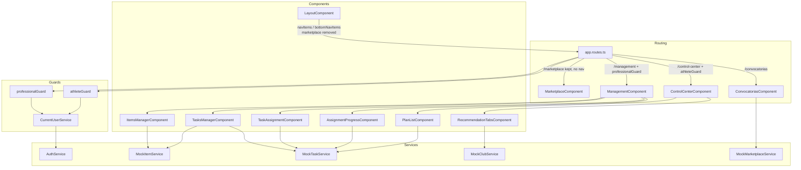
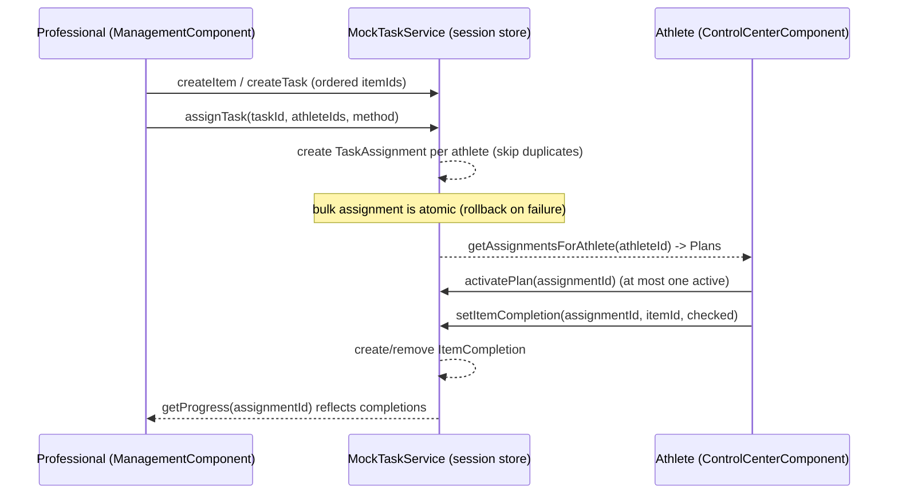

# Design Document

## Overview

This feature restructures the navigation and management surfaces of the Sora Sport Angular application and introduces a bidirectional professional/athlete workflow. It bundles four related concerns:

1. **Hide the Store** from both desktop and mobile navigation while keeping the `marketplace` route reachable by URL.
2. **Search Convocatorias** by publisher origin (`publisherName`) and `location` with debounced, case-insensitive, client-side filtering.
3. **Professional workspace** on the existing `/management` route: reusable **Items**, composable **Tasks**, multi-method **assignment** to athletes, and an athlete **progress** view.
4. **Athlete Control Center** on a new `/control-center` route: recommendation tabs (migrated from the current management view), **plan activation**, and per-item **check-off** that reflects back to the professional.

The end-to-end data flow is: a professional defines Items, composes them into Tasks, assigns a Task to one or more athletes (creating `TaskAssignment` records), the athlete activates an assignment as a Plan and checks off Items (creating `ItemCompletion` records), and the professional sees those completions in the progress view.

All persistence uses in-memory mock-data services scoped to the current browser session, consistent with the existing `src/app/mock-data/services/` layer. Per the project constraint, **every identifier introduced by this feature is in English** — route paths, model/interface names, file/folder names, variable names, and service names.

### Design context and constraints discovered in the codebase

- **Standalone components** with `inject()`, `signal()`, and `ChangeDetectionStrategy` are the norm (see `ManagementComponent`, `ConvocatoriasComponent`, `LayoutComponent`). New components follow the same shape. Note the existing components use `ChangeDetectionStrategy.Eager`; new components adopt `ChangeDetectionStrategy.OnPush` (the recommended default) since they are signal-driven, which is compatible with the existing app.
- **Routing** uses `loadComponent`/`loadChildren` lazy loading under a `LayoutComponent` shell guarded by `authGuard` (`app.routes.ts`).
- **Guards** are functional `CanActivateFn` using `inject()` (`auth.guard.ts`).
- **Existing mock services are stateless** — they return `of(STATIC_DATA)` and do not mutate. This feature requires **stateful** session persistence (CRUD, assignment, completion), so the new mock services introduce a mutable in-memory store while keeping the `Observable`-returning method signatures used elsewhere. This is called out explicitly as a deliberate, additive extension of the pattern.
- **Property-based testing** uses `fast-check` with `*.property.spec.ts` files and the tag convention `Feature: {feature}, Property {n}: {text}` (see `auth.guard.property.spec.ts`).
- **Role resolution is mid-migration.** `AuthService.currentUser()` is currently a deprecated stub returning `null`, and the live source of role data is the `userRoles(): string[]` signal (populated from the token). Existing feature components (`ManagementComponent`, `FeedComponent`, etc.) still call `currentUser()` and fall back to `MOCK_ATHLETES[0]`. To avoid coupling this feature to that in-progress migration, the design centralizes role/identity resolution behind a small `CurrentUserService` (design detail below) that this feature depends on. It resolves the current user's `id` and `UserRole` from whatever `AuthService` exposes, with a documented fallback, so routing guards and components have a single, testable source of truth.

## Architecture

### Route and role model

- `/management` is retained and **redefined** to host the professional workspace (`ManagementComponent`). It is guarded so only Professionals (any Non_Athlete_Role) may view it; Athletes are redirected to `/control-center`.
- `/control-center` is **added**, lazy-loaded, hosting the new `ControlCenterComponent`. It is guarded so only Athletes may view it; Professionals are redirected to `/management`.
- A user whose role cannot be determined is routed to the **default landing route** (`/feed`, the existing `redirectTo` target) and is shown neither area.
- `/marketplace` route is **kept unchanged**; only navigation entries are removed.

Role classification (English identifiers, from `UserRole` in `user.model.ts`):

- `athlete` → Athlete.
- `health-professional`, `coach`, `institution`, `management` → Professional (Non_Athlete_Role).
- anything unresolved / empty → Undetermined.

### Convocatorias route naming decision (Requirement 2 tradeoff)

The English-identifier constraint applies to identifiers this feature introduces. The `/convocatorias` route, its component, and the `Convocatoria` model already exist and are referenced by `app.routes.ts`, `LayoutComponent.navItems`, and `MockMarketplaceService`.

**Recommendation: keep the existing `/convocatorias` route path and `Convocatoria` model name unchanged; do not rename them as part of this feature.** Rationale:

- Renaming the route to `/open-calls` (or similar) would require touching the route table, both nav arrays, the folder/component/service names, and any deep links or bookmarks — a broad, risky change outside the scope of "add search".
- The constraint governs **new** identifiers; the search feature's new identifiers (e.g., `searchQuery`, filter logic, the empty-result flag) will be English.
- Renaming is a valid future cleanup but should be its own migration spec to avoid breaking existing links unnecessarily.

The **visible label** may be adjusted independently of the route path if desired, but that is a UI-copy decision, not an identifier decision, and is out of scope here.

### Component / service / routing diagram



### Bidirectional data flow (professional → assignment → athlete → completion → professional)



## Components and Interfaces

### Modified

- **`LayoutComponent`** (`src/app/core/layout/layout.component.ts`)
  - Remove the `marketplace` entry (`route: '/marketplace'`) from both `navItems` and `bottomNavItems`. The management entry remains a link to `/management`. No template control may navigate to `/marketplace`.

- **`app.routes.ts`**
  - Keep the `marketplace` route as-is.
  - Add `canActivate: [professionalGuard]` to the existing `management` route.
  - Add a new lazy route: `{ path: 'control-center', canActivate: [athleteGuard], loadComponent: () => import('./features/control-center/control-center.component').then(m => m.ControlCenterComponent) }`.

- **`ConvocatoriasComponent`** (`src/app/features/convocatorias/`)
  - Add a `searchQuery` signal backed by a Material input (`MatFormFieldModule`, `MatInputModule`), debounced within 1s (250ms `debounceTime` chosen; well within the 1s bound).
  - Store the full open list in a `allConvocatorias` signal; expose a `filteredConvocatorias` computed signal that applies the trimmed, case-insensitive `publisherName OR location` substring filter.
  - Show an empty-result indicator when the filter yields zero results while a query is present, retaining the input value.

- **`ManagementComponent`** (`src/app/features/management/`)
  - Repurposed as the **professional workspace**. The current athlete recommendation view is **migrated** to `ControlCenterComponent`. Management now composes child areas: Items, Tasks, Assignment, Progress (using `MatTabsModule`, consistent with the existing tabbed layout).

### New components

All under `src/app/features/`, standalone, signal-driven, `inject()`-based.

- **`ControlCenterComponent`** (`features/control-center/control-center.component.ts`) — athlete-facing shell. Hosts recommendation tabs (migrated logic), the plan list, activation, and item check-off.
- **`ItemsManagerComponent`** — Items CRUD UI with reactive-form validation (name 1–100, description 0–500, duration 1–1440).
- **`TasksManagerComponent`** — Tasks CRUD UI with a `mat-autocomplete` Item selector over the professional's own Items (≤10 suggestions, case-insensitive name-contains), ordered item list, validation (name 1–100, description 0–1000, items 1–100).
- **`TaskAssignmentComponent`** — assignment UI offering the three methods (direct, message-based, bulk 1–500), athlete selection, and validation messages.
- **`AssignmentProgressComponent`** — per-assignment athlete name + per-item completion state, with an "unavailable" error state.
- **`RecommendationTabsComponent`** — grouped-by-type recommendation lists (owner-only, most-recent-first). May be embedded in `ControlCenterComponent` or kept as a child; either way it reuses the existing `getTypeLabel`/`getRecommendationIcon` helpers migrated from `ManagementComponent`.
- **`PlanListComponent`** — athlete plan list with active-state indicator and per-item checkboxes.

(These may be implemented as smaller child components or as sections within the two page components; the interface contracts below are what matters.)

### New services

- **`CurrentUserService`** (`src/app/core/services/current-user.service.ts`)
  - `readonly userId: Signal<string>` and `readonly role: Signal<UserRole | 'undetermined'>`. The role guards decide directly from the `role` signal (`athlete` → Athlete, any other `UserRole` → Professional, `undetermined` → default landing).
  - Resolves identity/role from `AuthService`. Encapsulates the in-progress `currentUser()` → token-roles migration so guards and feature components have one source of truth.

- **`MockItemService`** (`src/app/mock-data/services/mock-item.service.ts`) — session-persistent Item store.
- **`MockTaskService`** (`src/app/mock-data/services/mock-task.service.ts`) — session-persistent store for Tasks, TaskAssignments, and ItemCompletions (co-located because assignment and completion operate over tasks and are the professional/athlete bridge; matches the "Task_Store" concept in the requirements glossary).

Service method contracts (all return `Observable<T>` via `of(...)` to match the existing mock convention; mutations update an internal signal-backed store):

```typescript
// MockItemService
getItemsForProfessional(professionalId: string): Observable<Item[]>;
searchItemsByName(professionalId: string, text: string, limit = 10): Observable<Item[]>;
createItem(input: ItemInput): Observable<Item>;
updateItem(id: string, input: ItemInput): Observable<Item>;        // errors if not owned/not found
deleteItem(id: string): Observable<void>;                          // errors if not owned/not found

// MockTaskService
getTasksForProfessional(professionalId: string): Observable<Task[]>;
createTask(input: TaskInput): Observable<Task>;
updateTask(id: string, input: TaskInput): Observable<Task>;
deleteTask(id: string): Observable<void>;

assignTask(taskId: string, athleteIds: string[], method: AssignmentMethod): Observable<AssignmentResult>;
getAssignmentsForProfessional(professionalId: string): Observable<TaskAssignment[]>;
getAssignmentsForAthlete(athleteId: string): Observable<TaskAssignment[]>;
getProgress(assignmentId: string): Observable<AssignmentProgress>;

activatePlan(athleteId: string, assignmentId: string): Observable<void>; // enforces one active per athlete
getActivePlan(athleteId: string): Observable<TaskAssignment | null>;

setItemCompletion(assignmentId: string, itemId: string, completed: boolean, athleteId: string): Observable<void>;
getCompletions(assignmentId: string): Observable<ItemCompletion[]>;
```

### New guards

- **`professionalGuard`** (`src/app/core/guards/professional.guard.ts`) — allows Non_Athlete_Roles; redirects Athletes to `/control-center`; redirects Undetermined to `/feed`.
- **`athleteGuard`** (`src/app/core/guards/athlete.guard.ts`) — allows Athletes; redirects Professionals to `/management`; redirects Undetermined to `/feed`.

Both are functional `CanActivateFn` using `inject(CurrentUserService)` and `inject(Router)`, matching `auth.guard.ts`. Each guard decides from the `CurrentUserService.role` signal: `athlete` is the sole athlete role, `undetermined` routes to `/feed`, and every other `UserRole` (Non_Athlete_Role) is treated as a Professional.

## Data Models

New models live in `src/app/core/models/management.model.ts` (English identifiers throughout).

```typescript
/** A reusable building block defined by a professional. */
export interface Item {
  id: string;
  professionalId: string;      // owner
  name: string;                // 1..100 chars
  description: string;         // 0..500 chars
  durationMinutes: number;     // 1..1440
  createdAt: string;           // ISO timestamp
}

/** Input payload for create/update (id and createdAt assigned by the store). */
export interface ItemInput {
  professionalId: string;
  name: string;
  description: string;
  durationMinutes: number;
}

/** A named unit of work composed of an ordered list of Items. */
export interface Task {
  id: string;
  professionalId: string;      // owner
  name: string;                // 1..100 chars
  description: string;         // 0..1000 chars
  itemIds: string[];           // ordered, length 1..100, references Item.id
  createdAt: string;
}

export interface TaskInput {
  professionalId: string;
  name: string;
  description: string;
  itemIds: string[];           // ordered
}

/** How a professional assigned a task to an athlete. */
export enum AssignmentMethod {
  Direct = 'direct',
  Message = 'message',
  Bulk = 'bulk',
}

/** Links a Task to a specific Athlete. */
export interface TaskAssignment {
  id: string;
  taskId: string;
  athleteId: string;
  assignedAt: string;          // ISO timestamp
  method: AssignmentMethod;
  active: boolean;             // true when this is the athlete's active Plan
}

/** Records that an athlete checked off a specific Item within an assignment. */
export interface ItemCompletion {
  id: string;
  taskAssignmentId: string;
  itemId: string;
  athleteId: string;
  completedAt: string;         // ISO timestamp
}

/** Result of an assignment operation. */
export interface AssignmentResult {
  created: TaskAssignment[];   // newly created assignments
  skipped: string[];           // athleteIds skipped as duplicates
}

/** Per-item completion state for the professional progress view. */
export interface ItemProgress {
  itemId: string;
  itemName: string;
  completed: boolean;
}

export interface AssignmentProgress {
  assignmentId: string;
  athleteId: string;
  athleteName: string | null;  // null when no athlete assigned
  items: ItemProgress[];
}
```

Validation bounds (enforced in reactive forms and re-validated in the mock services):

| Field | Rule |
| --- | --- |
| `Item.name` | length 1–100 |
| `Item.description` | length 0–500 |
| `Item.durationMinutes` | integer 1–1440 |
| `Task.name` | length 1–100 |
| `Task.description` | length 0–1000 |
| `Task.itemIds` | length 1–100 |
| bulk assignment `athleteIds` | length 1–500 |
| `searchQuery` | length 0–100, trimmed before use |

## Data Flow

1. **Item lifecycle** — `ItemsManagerComponent` calls `MockItemService.createItem/updateItem/deleteItem`. The store validates ownership and bounds, mutates its in-memory signal, and echoes the persisted record. The professional's list re-reads via `getItemsForProfessional`.
2. **Task composition** — `TasksManagerComponent` uses `searchItemsByName` (≤10, case-insensitive, own items) to feed `mat-autocomplete`; selecting a suggestion appends to the ordered `itemIds`. `createTask/updateTask` persist name, description, and ordered items.
3. **Assignment** — `TaskAssignmentComponent` calls `assignTask(taskId, athleteIds, method)`. Direct/message create a single assignment; bulk creates one per athlete (1–500). Existing `(taskId, athleteId)` pairs are skipped, not duplicated. Bulk is atomic: any failure rolls back all assignments created in that call and surfaces an error.
4. **Athlete plans** — `ControlCenterComponent`/`PlanListComponent` read `getAssignmentsForAthlete`. `activatePlan` marks one assignment active and clears any previously active one (at most one active per athlete). Re-activating the already-active plan is a no-op.
5. **Completion round-trip** — `setItemCompletion(assignmentId, itemId, true/false, athleteId)` creates/removes an `ItemCompletion` (only if the assignment belongs to that athlete). `AssignmentProgressComponent.getProgress` reflects those completions to the professional.

## Correctness Properties

*A property is a characteristic or behavior that should hold true across all valid executions of a system — essentially, a formal statement about what the system should do. Properties serve as the bridge between human-readable specifications and machine-verifiable correctness guarantees.*

These properties target the pure logic surfaces of the feature: the Convocatorias filter, the role-routing guards, and the session-persistent mock stores (`MockItemService`, `MockTaskService`). UI-timing, rendering, and error-toast behaviors are covered by example/edge tests in the Testing Strategy rather than by properties.

### Property 1: Search filter correctness

*For any* list of open Convocatoria records and *any* search query string, the filtered result set SHALL equal exactly the set of records whose `publisherName` or `location` contains the trimmed, lower-cased query as a substring (case-insensitive); when the trimmed query is empty, the result SHALL equal the entire open list.

**Validates: Requirements 2.2, 2.3, 2.4, 2.5, 2.6**

### Property 2: Role-guard routing

*For any* `UserRole` value, the `professionalGuard` SHALL allow activation when the role is a Non_Athlete_Role, redirect to `/control-center` when the role is `athlete`, and redirect to `/feed` when the role is undetermined; symmetrically the `athleteGuard` SHALL allow `athlete`, redirect Non_Athlete_Roles to `/management`, and redirect undetermined roles to `/feed`.

**Validates: Requirements 3.2, 3.3, 3.5, 3.7**

### Property 3: Item CRUD lifecycle and ownership round-trip

*For any* valid `ItemInput`, creating the Item then reading it back via `getItemsForProfessional(professionalId)` SHALL return a record whose `name`, `description`, and `durationMinutes` equal the input; editing an owned Item with valid values SHALL make the read-back equal the updated values; deleting an owned Item SHALL make it absent; and `getItemsForProfessional(p)` SHALL only ever return Items whose `professionalId` equals `p`.

**Validates: Requirements 4.2, 4.3, 4.4, 4.5**

### Property 4: Invalid or absent Item operations are rejected without side effects

*For any* `ItemInput` that violates a bound (name empty or length > 100, description length > 500, or duration outside 1–1440), and *for any* Item id that does not exist in the acting professional's list, the corresponding create/update/delete operation SHALL be rejected and the store's set of Items SHALL remain unchanged.

**Validates: Requirements 4.6, 4.7, 5.8, 5.9, 5.10**

### Property 5: Task persistence preserves ordered items

*For any* valid `TaskInput` (name 1–100, description 0–1000, 1–100 item ids), creating or editing the Task and reading it back SHALL yield `name`, `description`, and an `itemIds` sequence identical in contents and order to the input; and appending a selected Item to a task-in-progress SHALL place it at the end while leaving the existing prefix unchanged.

**Validates: Requirements 5.2, 5.5, 5.6, 5.7**

### Property 6: Item autocomplete suggestions

*For any* professional id, typed text of at least one character, and Item store, `searchItemsByName` SHALL return at most 10 Items, each owned by that professional and each having a `name` that contains the typed text matched case-insensitively.

**Validates: Requirements 5.3**

### Property 7: Assignment creates exactly one TaskAssignment per new athlete

*For any* task and *any* set of athlete ids, assigning through any method (direct, message, or bulk) SHALL create exactly one `TaskAssignment` for each athlete that does not already have an assignment for that task, and the created assignment SHALL carry the correct `taskId`, `athleteId`, and `method`.

**Validates: Requirements 6.1, 6.2, 6.3**

### Property 8: No duplicate TaskAssignment for the same task and athlete

*For any* sequence of assignment operations, the resulting set of `TaskAssignment` records SHALL contain no two records sharing the same `(taskId, athleteId)` pair; re-assigning an existing pair SHALL retain the existing assignment unchanged.

**Validates: Requirements 6.7**

### Property 9: Bulk assignment atomicity and rollback

*For any* bulk assignment in which the creation of one or more `TaskAssignment` records fails, the store SHALL end with exactly the assignments it had before the operation — none of the assignments attempted in that bulk call SHALL remain.

**Validates: Requirements 6.8**

### Property 10: At most one active plan per athlete

*For any* athlete and *any* sequence of `activatePlan` operations over that athlete's assignments, at every point at most one of the athlete's plans SHALL be active; activating a different plan SHALL clear the previously active one, and activating the already-active plan SHALL leave the active state unchanged.

**Validates: Requirements 9.1, 9.3, 9.4, 9.5**

### Property 11: Item completion bidirectional round-trip

*For any* `TaskAssignment` owned by an athlete and *any* Item within its Task, checking the Item off SHALL cause the professional's `getProgress` to report that Item as `completed`, and subsequently clearing it SHALL cause `getProgress` to report that Item as not completed — returning the progress to its state prior to the check.

**Validates: Requirements 7.2, 7.3, 10.1, 10.2, 10.3, 10.4**

### Property 12: Completion rejected for a non-assigned athlete

*For any* athlete, assignment, and item where the assignment's `athleteId` does not equal that athlete, `setItemCompletion` SHALL record no `ItemCompletion` and SHALL leave completion state unchanged.

**Validates: Requirements 10.6**

### Property 13: Control Center recommendations are owner-only, grouped, and most-recent-first

*For any* athlete and recommendation store, the Control Center's grouped recommendation view SHALL contain only recommendations whose owner is that athlete, SHALL produce exactly one non-empty group per distinct recommendation type present (and no group for absent types), and SHALL order the recommendations within each group from most recently created to least recently created.

**Validates: Requirements 8.1, 8.2, 8.3, 8.4**

## Error Handling

- **Validation errors (Items, Tasks, assignment selection).** Reactive-form validators enforce the bounds table before submission; the mock services re-validate defensively and reject out-of-bounds input by returning an errored `Observable` (`throwError`). Components keep the entered values, mark the offending control invalid, and render a field-specific message (Requirements 4.6, 5.8–5.10, 6.5, 6.6).
- **Not-found operations.** `updateItem`/`deleteItem`/`updateTask`/`deleteTask` on an id absent from the acting professional's collection reject with a not-found error; the component surfaces an "item/task not found" message and the store is untouched (Requirements 4.7).
- **Duplicate assignment.** Handled silently as a skip (not an error); the `AssignmentResult.skipped` array lets the UI report how many were already assigned (Requirement 6.7).
- **Bulk assignment failure.** `assignTask` for bulk performs all-or-nothing: it stages the new assignments and commits only if every creation succeeds; on any failure it discards the staged set and returns an error so the component shows "the bulk assignment did not complete" (Requirement 6.8).
- **Activation failure.** If `activatePlan` fails, the previously active plan remains active, no plan's active state changes, and the component shows an activation-failed message (Requirement 9.6).
- **Completion failure.** If `setItemCompletion` fails, the item's prior state is retained (the checkbox reverts) and a "change not saved" message is shown (Requirement 10.5). Attempts on a non-owned assignment are rejected with no record written (Requirement 10.6).
- **Progress unavailable.** If `getProgress` errors, `AssignmentProgressComponent` shows a "progress unavailable" indication and renders no item states (Requirement 7.5).
- **Recommendation load failure.** `ControlCenterComponent` retains the last successfully loaded recommendations and shows a load-error indication (Requirement 8.5).
- **Empty search result.** Not an error: the component shows an empty-result indicator and keeps the query in the input (Requirement 2.8).

## Testing Strategy

The feature uses a dual approach consistent with the existing suite: `fast-check` property tests in `*.property.spec.ts` files for the universal invariants above, and Karma/Jasmine example tests for concrete scenarios, boundaries, and UI behavior.

**Property-based testing (using `fast-check`, the library already in the project):**

- Each of the 13 correctness properties is implemented by a **single** property-based test.
- Each property test runs a **minimum of 100 iterations** (`fc.assert(..., { numRuns: 100 })` or higher).
- Each test is tagged with a comment referencing its design property, using the format: `Feature: management-restructure, Property {number}: {property_text}`.
- Property tests target pure logic: the Convocatorias filter (Property 1), the guards (Property 2), and the mock stores (Properties 3–13). Store tests instantiate a fresh service per run so state does not leak between iterations.
- Custom `fast-check` arbitraries generate: Convocatoria lists with overlapping/random `publisherName` and `location`; `UserRole` values including undetermined; valid and invalid `ItemInput`/`TaskInput`; athlete-id sets of sizes spanning 1–500; and activation/completion operation sequences.

**Example and edge tests (Karma/Jasmine):**

- **Navigation (1.1, 1.2, 1.4, 3.6):** assert `navItems` and `bottomNavItems` contain no `/marketplace` entry and that the management entry routes to `/management`.
- **Routing config (1.3, 1.5, 3.1):** assert the `marketplace` route is present with no redirect/role guard away from it, and that the `control-center` route exists with `athleteGuard`.
- **Search boundaries and timing (2.1, 2.7, 2.8):** boundary tests at query length 0/100/101; a `fakeAsync` test verifying the list updates within the debounce window (< 1s); a no-match test asserting the empty indicator shows and the query is retained.
- **Autocomplete no-match (5.4):** typing text with no matching item shows the "no matching items" indication.
- **Assignment UI (6.4, 6.5, 6.6):** all three methods are offered; empty selection is rejected with a message within 2s; bulk boundary at 500 (accepted) and 501 (rejected).
- **Progress rendering (7.1, 7.4, 7.5):** athlete name shown; no-athlete assignment shows all items not-completed with an indication; `getProgress` failure shows the unavailable state.
- **Active indicator and failures (9.2, 9.6):** the active plan renders the indicator and inactive plans do not; injected activation failure retains the previous active plan and shows an error.
- **Completion failure (10.5):** injected persistence failure retains prior state and shows a "not saved" message.
- **Recommendation load failure (8.5):** a failing load retains previously displayed recommendations and shows an error.

**Unit-test balance:** example tests are kept focused on specific scenarios, boundaries, and UI wiring; the broad input coverage (all queries, all roles, all valid/invalid inputs, all operation sequences) is delegated to the property tests to avoid redundant example cases.

