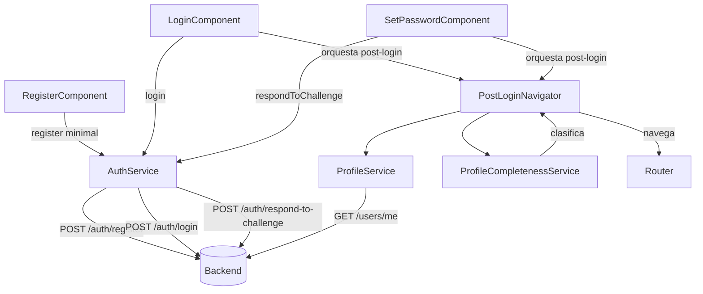
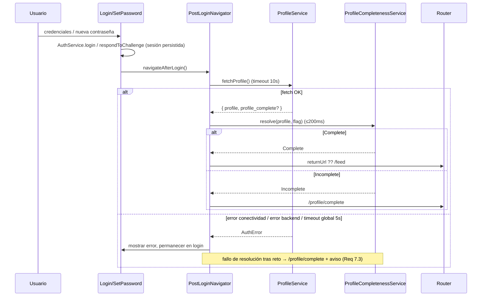

# Design Document

## Overview

Esta reforma reduce el registro del Frontend Angular (`Sport_fe`) a lo mínimo (correo + contraseña + confirmación) y traslada el resto del perfil a un flujo posterior. El cambio abarca tres capas:

1. **Registro reducido** (Req 1, 2, 3): simplificar `RegisterComponent` y el modelo `RegisterRequest` para enviar solo los datos mínimos, manteniendo el manejo de respuestas y errores ya establecido por `auth-backend-integration` (extracción de `Error_Body`, estado 0 de conectividad).
2. **Obtención y resolución de completitud del perfil** (Req 4, 5): introducir un `ProfileService` que consulta el perfil autenticado tras el inicio de sesión, y un `ProfileCompletenessService` (el Completeness_Resolver) que decide si el perfil está completo, prefiriendo una bandera del backend y recurriendo a un cálculo por campos requeridos configurable.
3. **Enrutamiento posterior al inicio de sesión** (Req 6, 7): orquestar, tras `login()` y tras `respondToChallenge()`, la secuencia obtener perfil → resolver completitud → navegar, reconciliando la URL de retorno con la prioridad del flujo de completar perfil.

Este diseño resuelve explícitamente las dos decisiones abiertas señaladas en los requisitos (ver [Decisiones de Diseño](#decisiones-de-diseño-abiertas)). Se mantiene consistente con el manejo de tokens, retos (`NEW_PASSWORD_REQUIRED`) y errores ya implementado en `AuthService`.

### Alcance

Solo Frontend. No define comportamiento nuevo del backend ni el contenido del formulario de completar perfil. Asume el contrato del backend en dos puntos que deben confirmarse (marcados como **[CONFIRMAR CON BACKEND]**): la ruta del Profile_Endpoint y la presencia/ubicación de la bandera de completitud.

## Decisiones de Diseño (abiertas)

### Decisión 1: `tenant_id` en el registro (Req 2.4, 2.6)

**Recomendación: eliminar `tenant_id` y `full_name` del `RegisterRequest` y del cuerpo enviado por `AuthService.register()`.** La reforma define el registro como correo + contraseña, por lo que el modelo de la petición queda con exactamente `email` y `password`.

**Rationale:** El formulario ya no recolecta ni nombre ni club (Req 1.2), y forzar un `tenant_id` obligatorio en el formulario (comportamiento actual, con validador `uuid`) contradice el objetivo de la reforma. Enviar el mínimo evita datos de perfil innecesarios (Req 2.2, 2.3).

**Fallback controlado y comprobable (Req 2.6):** SI el Register_Endpoint todavía rechaza peticiones sin `tenant_id`, el `tenant_id` se obtiene de una **fuente no interactiva** (configuración) y nunca de un campo visible del formulario. Se modela mediante un `InjectionToken` opcional `DEFAULT_TENANT_ID` (mismo patrón que `API_BASE_URL` en `src/app/core/config/api.config.ts`), por defecto `null`:

```typescript
export const DEFAULT_TENANT_ID = new InjectionToken<string | null>('DEFAULT_TENANT_ID', {
  providedIn: 'root',
  factory: () => null, // Sin tenant por defecto: no se envía tenant_id.
});
```

`register()` incluye `tenant_id` **solo** cuando el token resuelve a un valor no vacío. Esto hace la decisión reversible por configuración y directamente testeable: con el token en `null`, el cuerpo no contiene `tenant_id`; con un valor configurado, sí lo contiene (sin intervención del formulario). El validador `uuid` y el control `tenant_id` del formulario se eliminan de `RegisterComponent`.

### Decisión 2: fuente de verdad de la completitud (Req 5.1, 5.2)

**Recomendación: `ProfileCompletenessService` (Completeness_Resolver) prefiere una bandera del backend `Profile_Completeness_Flag` de tipo booleano cuando está presente, y recurre a un cálculo por `Required_Fields` configurable cuando la bandera está ausente, es `null` o no es booleana.**

**Ubicación de la bandera [CONFIRMAR CON BACKEND]:** se asume que la respuesta del Profile_Endpoint es un sobre `{ profile: UserProfileDto, profile_complete?: boolean }`. El campo `profile_complete` es la `Profile_Completeness_Flag`. Si el backend la ubica dentro del propio DTO, solo cambia el mapeo en `ProfileService`, sin afectar al resolver.

**`Required_Fields` configurable (Req 5.2, 5.3):** el `UserProfileDto` actual (`user-profile-dtos`) es explícitamente un mock desechable ("Intended to be deleted later"). Por eso el conjunto de campos requeridos NO se acopla de forma rígida a ese mock: se define como una lista configurable de rutas de campo (`RequiredFieldPath[]`) inyectada mediante un `InjectionToken` `PROFILE_REQUIRED_FIELDS`, cuyo valor por defecto son los campos del bloque `common` que hoy están marcados como requeridos en TypeScript (sin `?`):

`common.profilePhoto`, `common.email`, `common.firstName`, `common.lastName`, `common.birthDate`, `common.identityDocumentNumber`, `common.documentTypeId`, `common.idCardVerification`, `common.nationalityId`, `common.sexId`, `common.personTypeId`.

"Presente" = valor **no nulo y distinto de cadena vacía** (Req 5.3). Para campos de tipo objeto (p. ej. `profilePhoto: ProfileAttachment`) se considera presente si el objeto existe y no es vacío. Cuando el mock DTO sea reemplazado, solo se actualiza la lista `PROFILE_REQUIRED_FIELDS`, sin tocar la lógica del resolver.

## Architecture

### Diagrama de componentes



`PostLoginNavigator` es un servicio de orquestación reutilizable (no un componente) invocado tanto por `LoginComponent` como por `SetPasswordComponent`, garantizando comportamiento idéntico en el flujo normal y en el flujo de reto (Req 7.1).

### Flujo posterior al inicio de sesión



## Components and Interfaces

### RegisterComponent (modificado) — Req 1, 2, 3

El formulario se reduce a tres controles. Se eliminan `full_name`, `tenant_id` y `account_type`, y sus validadores (`nonBlank`, `maxLength(200)`, `uuid`).

```typescript
readonly form = this.fb.nonNullable.group({
  email: ['', [AuthValidators.required(), AuthValidators.email()]],
  password: ['', [AuthValidators.required(), AuthValidators.password()]],
  confirmPassword: ['', [AuthValidators.required(), AuthValidators.matchField('password')]],
});
```

- Mensajes en español según Req 1.3–1.7 (correo obligatorio / ≤254 / formato / contraseña 8–72 / contraseñas no coinciden). Los validadores existentes (`email`, `password`, `matchField`) ya cubren estas reglas; la plantilla mapea los mensajes.
- El control de envío permanece deshabilitado mientras el formulario es inválido (Req 1.9) y se habilita/despacha en ≤1s cuando es válido (Req 1.8).
- Al enviar solo se toman `email` y `password` (la confirmación no viaja al backend).
- Preservación de valores tras error (Req 3.2, 3.3, 3.5): NO se llama a `form.reset()` en la rama de error; se limpia únicamente el campo de contraseña (y su confirmación). En éxito 201 (Req 3.1) se muestra el mensaje de confirmación en ≤2s y se puede resetear el formulario.
- El mapeo de errores (409 email ya registrado, 400 validación con fallback genérico, 500 servidor, 0 conectividad) reutiliza el patrón `mapError` ya presente; se elimina el caso 404 "institución" por dejar de aplicar.

### AuthService.register (modificado) — Req 2

```typescript
register(data: RegisterRequest): Observable<RegisterResponse> {
  this._isLoading.set(true);
  const tenantId = this.defaultTenantId; // DEFAULT_TENANT_ID, por defecto null
  const body = {
    email: data.email,
    password: data.password,
    ...(tenantId ? { tenant_id: tenantId } : {}),
  };
  return this.http.post<RegisterResponse>(`${this.apiBaseUrl}/auth/register`, body).pipe(
    catchError((error) => this.handleError(error)),
    finalize(() => this._isLoading.set(false)),
  );
}
```

- El cuerpo contiene exactamente `email` y `password`, más `tenant_id` solo si la configuración lo provee (Req 2.1, 2.6). Se excluyen `full_name` y cualquier otro campo de perfil (Req 2.2, 2.3).
- El timeout de 10s de conectividad (Req 3.6) se aplica con el operador `timeout(10000)` de RxJS antes de `catchError`, mapeando el vencimiento al mismo `AuthError` de estado 0 que produce `handleError` para `status === 0`.

### ProfileService (nuevo) — Req 4

Servicio `@Injectable({ providedIn: 'root' })` que obtiene el perfil autenticado.

```typescript
interface ProfileResponse {
  profile: UserProfileDto;
  profile_complete?: boolean; // Profile_Completeness_Flag [CONFIRMAR CON BACKEND]
}

@Injectable({ providedIn: 'root' })
export class ProfileService {
  private readonly http = inject(HttpClient);
  private readonly apiBaseUrl = inject(API_BASE_URL);

  // [CONFIRMAR CON BACKEND] ruta asumida: GET /users/me
  fetchProfile(): Observable<ProfileResponse> {
    return this.http.get<ProfileResponse>(`${this.apiBaseUrl}/users/me`).pipe(
      timeout(10_000),                       // Req 4.2, 4.3
      catchError((error) => this.handleError(error)),
    );
  }
}
```

- El token de acceso lo adjunta el interceptor de autenticación existente; `ProfileService` no manipula tokens.
- `handleError` sigue el mismo contrato que `AuthService.handleError`: estado 0 → `AuthError` de conectividad; timeout → estado 0; otros → `AuthError` con mensaje del `Error_Body`. Para no duplicar lógica, se extrae la función de mapeo a un helper compartido (`mapHttpErrorToAuthError`) que ambos servicios reutilizan.
- **Ruta asumida:** `GET /users/me`. Alternativa considerada: `GET /profile`. Se elige `/users/me` por ser la convención más común para "el usuario autenticado"; queda marcada para confirmar.

### ProfileCompletenessService / Completeness_Resolver (nuevo) — Req 5

```typescript
type Completeness = 'complete' | 'incomplete';
type RequiredFieldPath = string; // p. ej. 'common.email'

interface CompletenessResult {
  status: Completeness;
  errored: boolean; // true si la evaluación falló (Req 5.7)
}

@Injectable({ providedIn: 'root' })
export class ProfileCompletenessService {
  private readonly requiredFields = inject(PROFILE_REQUIRED_FIELDS);

  resolve(profile: UserProfileDto, flag: unknown): CompletenessResult {
    try {
      // Req 5.1: preferir la bandera del backend cuando es booleana.
      if (typeof flag === 'boolean') {
        return { status: flag ? 'complete' : 'incomplete', errored: false };
      }
      // Req 5.2: respaldo por Required_Fields cuando la bandera está ausente/null/no booleana.
      const allPresent = this.requiredFields.every((path) => this.isPresent(profile, path));
      return { status: allPresent ? 'complete' : 'incomplete', errored: false };
    } catch {
      // Req 5.7: ante fallo, clasificar Incomplete y señalar error, preservando el DTO.
      return { status: 'incomplete', errored: true };
    }
  }

  private isPresent(profile: UserProfileDto, path: RequiredFieldPath): boolean {
    const value = path.split('.').reduce<any>((acc, key) => acc?.[key], profile);
    if (value === null || value === undefined) return false;   // Req 5.3, 5.4
    if (typeof value === 'string') return value.trim().length > 0;
    if (typeof value === 'object') return Object.keys(value).length > 0;
    return true;
  }
}
```

- Precedencia de la bandera sobre el cálculo (Req 5.1); respaldo solo cuando la bandera no es booleana (Req 5.2).
- "Presente" = no nulo y no cadena vacía (Req 5.3); ausente = nulo o cadena vacía → Incomplete (Req 5.4).
- No exige campos opcionales (Req 5.5): la lista `PROFILE_REQUIRED_FIELDS` solo incluye campos requeridos.
- Ejecución síncrona y acotada (≤200ms, Req 5.6): recorrer una lista pequeña de rutas es O(n) sobre pocos campos.
- Ruta de error → Incomplete + `errored: true` (Req 5.7); el DTO se pasa por referencia y no se muta.

### PostLoginNavigator (nuevo) — Req 4, 6, 7

Servicio de orquestación que encapsula "fetch perfil → resolver → navegar". Invocado por `LoginComponent` (tras login sin reto) y `SetPasswordComponent` (tras `respondToChallenge`).

```typescript
@Injectable({ providedIn: 'root' })
export class PostLoginNavigator {
  private readonly profile = inject(ProfileService);
  private readonly resolver = inject(ProfileCompletenessService);
  private readonly auth = inject(AuthService);
  private readonly router = inject(Router);

  /** Devuelve un Observable que emite el resultado o un AuthError para que el
   *  componente muestre el mensaje y permanezca en la pantalla de login. */
  navigateAfterLogin(): Observable<void> {
    return this.profile.fetchProfile().pipe(
      timeout(5_000),                                  // Req 6.5 / 7.3: tope global de resolución
      map((res) => this.resolver.resolve(res.profile, res.profile_complete)),
      tap((result) => this.route(result)),
      map(() => void 0),
      catchError((error) => this.handleResolutionFailure(error)),
    );
  }

  private route(result: CompletenessResult): void {
    if (result.status === 'incomplete') {
      this.auth.clearReturnUrl();                      // Req 6.4: completar perfil tiene prioridad
      this.router.navigate(['/profile/complete']);     // Req 6.2
      return;
    }
    const returnUrl = this.auth.getReturnUrl();         // Req 6.1, 6.3
    if (returnUrl) {
      this.auth.clearReturnUrl();
      this.router.navigateByUrl(returnUrl);
    } else {
      this.router.navigate(['/feed']);
    }
  }

  private handleResolutionFailure(error: unknown): Observable<never> {
    // Req 6.5 / 7.3: fallo o vencimiento de resolución → navegar a completar perfil
    // con aviso "no se pudo determinar el destino", manteniendo la sesión activa.
    // Excepción: los errores de fetch de perfil (conectividad/error backend, Req 4.3/4.4)
    // NO navegan; se propagan para que el componente permanezca en login.
    ...
  }
}
```

- **Distinción clave de comportamiento entre Req 4 y Req 6.5/7.3:**
  - Un **fallo al obtener el perfil** (conectividad, timeout de 10s del fetch, o error de backend) → mostrar error y **permanecer en login**, sin navegar (Req 4.3, 4.4).
  - Un **fallo/timeout de la resolución de completitud** (después de tener el perfil) → navegar a `/profile/complete` con aviso (Req 6.5). Tras reto, además, mantener la sesión activa (Req 7.3).
  - Se distinguen por el origen del error dentro del pipe (el error del `fetchProfile` llega como `AuthError`; el `timeout(5_000)` global y la marca `errored` del resolver se tratan como fallo de resolución).
- Consistencia con el reto (Req 7): `SetPasswordComponent` invoca el mismo `navigateAfterLogin()`, por lo que Req 4/5/6 aplican sin diferencias (Req 7.1, 7.2). Durante la resolución no se navega a rutas protegidas hasta resolver (Req 7.4), garantizado porque la navegación ocurre solo en `route()`.

### Enrutamiento (modificado) — Req 6

Se añade una ruta de completar perfil bajo el shell protegido, reutilizando el grupo existente en `app.routes.ts`:

```typescript
{
  path: 'profile',
  loadChildren: () => import('./features/profile/profile.routes').then(m => m.PROFILE_ROUTES),
}
```

En `profile.routes.ts` se añade `{ path: 'complete', loadComponent: ... }`, dando la ruta `/profile/complete`. Queda bajo `authGuard` (el usuario ya está autenticado tras login/reto), lo cual es correcto: un perfil incompleto pero con sesión válida debe poder acceder a completar perfil. El contenido del formulario de completar perfil queda fuera de alcance (solo se define la ruta y el destino de navegación).

## Data Models

### RegisterRequest (modificado) — Req 2.4

```typescript
export interface RegisterRequest {
  email: string;
  password: string;
  // tenant_id se añade solo en tiempo de ejecución desde DEFAULT_TENANT_ID
  // cuando el backend lo requiera (Req 2.6). No se recolecta en el formulario.
}
```

Se eliminan `full_name` y `account_type` del modelo. `RegisterResponse` no cambia.

### ProfileResponse (nuevo) — Req 4, 5

```typescript
export interface ProfileResponse {
  profile: UserProfileDto;         // Req 4.2
  profile_complete?: boolean;      // Profile_Completeness_Flag [CONFIRMAR CON BACKEND]
}
```

### Configuración inyectable

- `DEFAULT_TENANT_ID: InjectionToken<string | null>` (por defecto `null`) — Req 2.6.
- `PROFILE_REQUIRED_FIELDS: InjectionToken<RequiredFieldPath[]>` (por defecto los campos requeridos del bloque `common`) — Req 5.2, 5.3.

## Correctness Properties

*Una propiedad es una característica o comportamiento que debe cumplirse en todas las ejecuciones válidas del sistema; es una afirmación formal sobre lo que el sistema debe hacer. Las propiedades sirven de puente entre las especificaciones legibles por humanos y las garantías de corrección verificables por máquina.*

### Property 1: El cuerpo de registro contiene exactamente el conjunto permitido

*Para todo* par (email, password) no vacío, el cuerpo que `AuthService.register()` envía al Register_Endpoint contiene exactamente las claves `email` y `password` cuando `DEFAULT_TENANT_ID` es `null`, y exactamente `email`, `password`, `tenant_id` cuando `DEFAULT_TENANT_ID` provee un valor no vacío; nunca contiene `full_name`, `account_type` ni ningún otro campo de perfil.

**Validates: Requirements 2.1, 2.2, 2.3, 2.4, 2.6**

### Property 2: La precedencia de la bandera de completitud es determinista

*Para todo* perfil y *para todo* valor de bandera que sea booleano, `ProfileCompletenessService.resolve()` clasifica según la bandera (`true` → complete, `false` → incomplete), independientemente del contenido del perfil.

**Validates: Requirements 5.1**

### Property 3: El respaldo por campos requeridos es correcto

*Para todo* perfil y *para toda* bandera que NO sea booleana (ausente, nula o de otro tipo), `resolve()` clasifica como `complete` si y solo si todos los campos de `PROFILE_REQUIRED_FIELDS` están presentes (no nulos y distintos de cadena vacía), y como `incomplete` si al menos uno está ausente.

**Validates: Requirements 5.2, 5.3, 5.4**

### Property 4: Los campos opcionales no afectan la completitud

*Para todo* perfil cuyos campos requeridos están todos presentes, `resolve()` (por el camino de respaldo) lo clasifica como `complete` sin importar el estado de cualquier campo opcional del `UserProfileDto`.

**Validates: Requirements 5.5**

### Property 5: El destino posterior al login es función de la completitud y la URL de retorno

*Para todo* resultado de completitud y *para todo* estado de URL de retorno: si el perfil es `incomplete`, el destino es siempre `/profile/complete` (aunque exista URL de retorno); si es `complete`, el destino es la URL de retorno cuando existe y `/feed` en su ausencia.

**Validates: Requirements 6.1, 6.2, 6.3, 6.4**

### Property 6: El fallo de resolución degrada de forma segura

*Para toda* evaluación de completitud que falle (excepción interna o marca `errored`), `resolve()` devuelve `incomplete` y no muta el perfil recibido.

**Validates: Requirements 5.7, 6.5**

## Error Handling

- **Registro (Req 3):** el mapeo de estado sigue el patrón existente de `RegisterComponent.mapError` — 409 (email ya registrado), 400 (validación derivada del `Error_Body`, con fallback genérico "Datos inválidos" cuando el cuerpo está vacío o ilegible, Req 3.4), 500 (error de servidor), 0 (conectividad, Req 3.6). En todas las ramas de error se preservan los valores del formulario excepto la contraseña.
- **Obtención de perfil (Req 4.3, 4.4):** `ProfileService.fetchProfile()` aplica `timeout(10_000)` y `mapHttpErrorToAuthError`. El `PostLoginNavigator` distingue error de fetch (permanecer en login, mostrar mensaje) de fallo de resolución (navegar a completar perfil). Estado 0 → mensaje de conectividad; otros estados → mensaje del `Error_Body` o genérico.
- **Resolución (Req 5.7, 6.5, 7.3):** cualquier excepción o vencimiento del tope global de 5s clasifica Incomplete, navega a `/profile/complete` y presenta el aviso "no se pudo determinar el destino"; tras el flujo de reto la sesión permanece activa.
- **Helper compartido `mapHttpErrorToAuthError`:** se extrae de `AuthService.handleError` para evitar divergencia entre servicios (misma extracción de `Error_Body` y mismo mapeo de estado 0/timeout).

## Testing Strategy

Enfoque dual: pruebas basadas en propiedades para la lógica pura (resolución de completitud, construcción del cuerpo de registro, decisión de destino) y pruebas por ejemplos/unitarias para la UI, la integración HTTP y los casos de error.

**Aplicabilidad de PBT:** el `ProfileCompletenessService`, la construcción del cuerpo en `register()` y la función de decisión de destino son funciones puras con espacios de entrada amplios (perfiles arbitrarios, banderas de tipo arbitrario, presencia/ausencia de URL de retorno), por lo que son idóneas para PBT. El renderizado del formulario, la navegación real y la integración HTTP se cubren con pruebas por ejemplos y mocks.

### Pruebas basadas en propiedades

- Biblioteca: **fast-check** (estándar para TypeScript/Angular). No se implementa PBT desde cero.
- Mínimo **100 iteraciones** por prueba de propiedad.
- Cada prueba etiqueta la propiedad del diseño. Formato de etiqueta: **Feature: register-reform, Property {número}: {texto}**.
- Propiedad 1 → generar (email, password) arbitrarios y `DEFAULT_TENANT_ID` con/sin valor; verificar el conjunto exacto de claves del cuerpo.
- Propiedades 2–4 y 6 → generar `UserProfileDto` arbitrarios (con bloque `common` parcial/completo, campos opcionales aleatorios) y banderas de tipo arbitrario (`boolean`, `null`, `undefined`, `number`, `string`); verificar la clasificación.
- Propiedad 5 → generar resultado de completitud y presencia/ausencia de URL de retorno; verificar el destino calculado con un `Router` espía.

### Pruebas unitarias / por ejemplos

- `RegisterComponent`: validación de correo (vacío, >254, formato), contraseña (8–72), coincidencia de confirmación; deshabilitado del envío mientras es inválido (Req 1.6–1.9); preservación de valores y limpieza de contraseña en 409/400/500/0 (Req 3.2–3.6); mensaje de éxito 201 (Req 3.1).
- `ProfileService`: 200 con perfil, timeout de 10s → `AuthError` de conectividad, error de backend → `AuthError` (Req 4.2–4.4), con `HttpTestingController`.
- `PostLoginNavigator`: destino complete→returnUrl/`/feed`, incomplete→`/profile/complete`, fallo de fetch→permanecer en login, fallo de resolución→`/profile/complete`+aviso (Req 6.5); invocación idéntica desde `SetPasswordComponent` (Req 7.1, 7.3, 7.4).
- Integración del enrutamiento: la ruta `/profile/complete` bajo `authGuard` es alcanzable con sesión válida.
