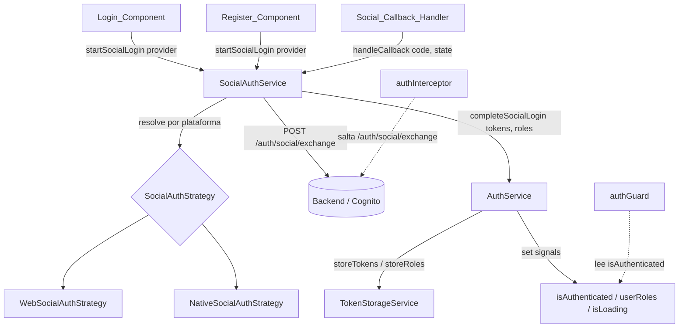
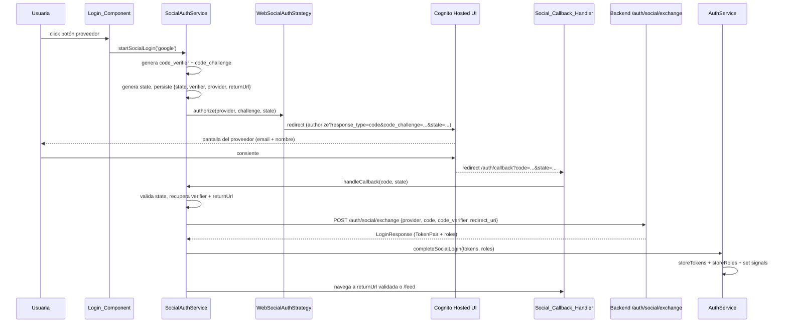
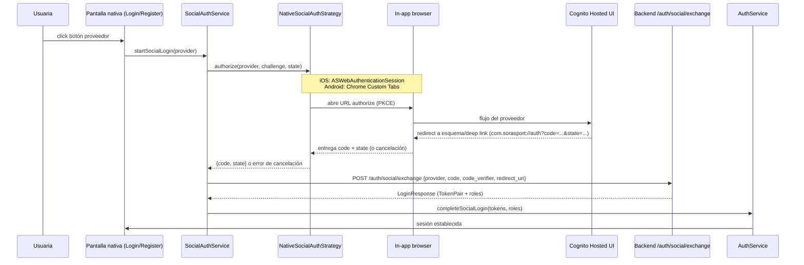

# Design Document

## Overview

Este documento describe el diseño técnico de la funcionalidad de **Autenticación Social** de Sora Sport. La funcionalidad añade inicio de sesión y registro mediante los proveedores federados **Google**, **Facebook** y **Sign in with Apple** en las tres plataformas objetivo: **Web** (Angular 22), **Android** e **iOS**.

El principio rector del diseño es la **reutilización total del contrato de sesión existente**: el flujo social termina exactamente igual que el login por correo y contraseña. Es decir, obtiene el mismo `TokenPair`, lo persiste con el mismo `TokenStorageService` (clave `sora-sport-auth-tokens`), establece los mismos signals del `AuthService` (`isAuthenticated`, `userRoles`, `isLoading`) y, a partir de ese punto, el `authInterceptor` y el `authGuard` operan sin cambios en su contrato. La única modificación necesaria sobre las piezas existentes es que el `authInterceptor` debe saltar también el nuevo endpoint de intercambio social (igual que ya salta `/auth/login`).

El backend es AWS Cognito con proveedores de identidad federados. El diseño adopta el flujo **OAuth 2.0 Authorization Code con PKCE** contra la Hosted UI / federación de Cognito. Este flujo es coherente entre Web y móvil y es el recomendado por las guías de seguridad actuales para clientes públicos (SPA y apps nativas), frente al flujo implícito que expone tokens en la URL y carece de secreto de cliente.

Para desacoplar la lógica de orquestación de los detalles de cada plataforma se introduce una **abstracción de estrategia de plataforma** (`SocialAuthStrategy`), con implementaciones Web y Native, resuelta vía token de inyección. El `SocialAuthService` (nuevo) orquesta el flujo apoyándose en la estrategia y delega la finalización de sesión en el `AuthService` mediante un método nuevo `completeSocialLogin(...)`.

La selección de tenant/institución queda **fuera de alcance** (Requisito 10): el flujo social termina al establecer la sesión.

### Fundamento de la decisión: Authorization Code + PKCE

- **Cliente público sin secreto**: Tanto la SPA como las apps nativas no pueden custodiar un secreto de cliente. PKCE (RFC 7636) sustituye el secreto por un par `code_verifier`/`code_challenge` generado por el cliente en cada intento, evitando la intercepción del código de autorización.
- **Tokens fuera de la URL**: A diferencia del flujo implícito, los tokens no viajan en el fragmento de la URL de redirección; se obtienen en un intercambio servidor-a-servidor (aquí, frontend → backend → Cognito), reduciendo la exposición en historial, logs y referrers.
- **Coherencia multiplataforma**: El mismo flujo aplica en Web (redirección + `/auth/callback`) y en nativo (in-app browser que devuelve el `code` vía deep link / esquema de redirección), variando sólo el mecanismo de apertura del navegador y de captura del callback.
- **Protección CSRF**: El parámetro `state` (opaco, aleatorio) se valida al regresar, y actúa además como clave para recuperar la `Return_URL` preservada.

## Architecture

### Componentes y su relación



### Flujo Web: Authorization Code + PKCE con callback



### Flujo Nativo (Android / iOS)



### Decisiones arquitectónicas y su justificación

| Decisión | Alternativa descartada | Justificación |
|---|---|---|
| Authorization Code + PKCE | Implicit flow | PKCE protege clientes públicos sin secreto y no expone tokens en la URL (Requisito 3, 5, 7). |
| `SocialAuthStrategy` con token de inyección + implementaciones Web/Native | Ramas `if (platform)` dispersas en el servicio | Aísla los detalles de plataforma; el `SocialAuthService` no depende de web ni de la capa nativa (Requisito 7). |
| `SocialAuthService` por composición sobre `AuthService` | Meter toda la lógica social dentro de `AuthService` | Mantiene `AuthService` enfocado; la finalización se centraliza en `completeSocialLogin`, reutilizando storage y signals (Requisito 3). |
| Intercambio del `code` en el backend (`/auth/social/exchange`) | Que el frontend hable directo con el token endpoint de Cognito | El backend ya media login/registro, aplica vinculación de cuentas y emite el `TokenPair` propio; el frontend nunca custodia credenciales de Cognito (Requisitos 3, 4). |
| `state` opaco como clave de la `Return_URL` preservada | Pasar la `Return_URL` en claro por el redirect | Evita manipulación y open-redirect; la URL se guarda localmente y sólo se recupera si el `state` valida (Requisitos 8, 5). |

## Components and Interfaces

### 1. `SocialAuthService` (nuevo)

Servicio inyectable (`providedIn: 'root'`) que orquesta el flujo completo. No manipula `localStorage` de tokens ni los signals directamente: delega la finalización en `AuthService.completeSocialLogin`.

```typescript
@Injectable({ providedIn: 'root' })
export class SocialAuthService {
  // Inicia el flujo: genera PKCE + state, persiste contexto y delega en la estrategia de plataforma.
  startSocialLogin(provider: SocialProvider): Promise<void>;

  // (Solo Web) Procesa el callback: valida state, intercambia el code y finaliza la sesión.
  handleCallback(code: string, state: string): Observable<LoginResponse>;

  // Cancela/limpia el contexto pendiente (verifier, state, provider) sin tocar la sesión previa.
  cancelPending(): void;
}
```

Responsabilidades:
- Generar `code_verifier`/`code_challenge` (PKCE) y un `state` aleatorio.
- Persistir el **contexto pendiente** (`SocialAuthPendingContext`) para recuperarlo tras el redirect.
- Resolver el `redirect_uri` según plataforma.
- Ejecutar el intercambio `POST /auth/social/exchange` y validar que el `TokenPair` sea completo (los 4 campos) antes de finalizar.
- Aplicar el timeout de 30 s (Requisito 5.4) al flujo del proveedor y traducir cancelación / error de proveedor / red / backend a `AuthError`.
- Resolver la `Return_URL` (validada como ruta interna) y navegar.

### 2. `AuthService` (extensión mínima)

Se añade un único método público, sin alterar los existentes:

```typescript
// Finaliza cualquier autenticación social: persiste tokens y roles, y establece los signals.
// Reutiliza exactamente la misma mecánica que login()/respondToChallenge().
completeSocialLogin(tokens: TokenPair, roles: string[]): void;
```

- Valida internamente que `tokens` tenga los 4 campos; si no, descarta y deja `isAuthenticated = false` (Requisito 1.12).
- En éxito: `tokenStorage.storeTokens(tokens)`, `tokenStorage.storeRoles(roles)`, `_isAuthenticated.set(true)`, `_userRoles.set(roles)`.
- El manejo de `isLoading` se coordina desde `SocialAuthService` (que representa el flujo social completo, más largo que una sola llamada HTTP).

### 3. `SocialAuthStrategy` (abstracción de plataforma)

```typescript
export interface SocialAuthStrategy {
  // Abre el flujo del proveedor. En Web redirige (no retorna); en Native resuelve con el callback.
  authorize(request: SocialAuthorizeRequest): Promise<SocialAuthorizeResult>;
  // redirect_uri propio de la plataforma (web: origin + /auth/callback; native: esquema/deep link).
  getRedirectUri(): string;
}

export const SOCIAL_AUTH_STRATEGY = new InjectionToken<SocialAuthStrategy>('SOCIAL_AUTH_STRATEGY');
```

- `WebSocialAuthStrategy`: construye la URL `authorize` de Cognito y ejecuta `window.location.assign`. El resultado llega por el `Social_Callback_Handler`, no por retorno.
- `NativeSocialAuthStrategy`: abre un in-app browser (iOS `ASWebAuthenticationSession`, Android Chrome Custom Tabs) y resuelve con `{ code, state }` o un error de cancelación cuando la persona cierra el navegador. La integración concreta con la capa nativa (Capacitor u otro contenedor) se realiza detrás de esta estrategia; **el resto del código no depende de ella**.

Un `provider` de plataforma resuelve `SOCIAL_AUTH_STRATEGY` en `app.config.ts` según el entorno de ejecución. La selección SIEMPRE resuelve una estrategia no nula para `web`, `android` e `ios` (Requisito 7).

### 4. `Social_Callback_Handler` (nuevo componente, solo Web)

Componente standalone (`ChangeDetectionStrategy.OnPush`) montado en la ruta `/auth/callback`.

- Lee `code` y `state` de los query params.
- Si el proveedor devolvió `error`/`error_description` o falta `code`: trata como error/cancelación (Requisitos 5.1, 5.2).
- Llama `socialAuthService.handleCallback(code, state)`.
- En éxito, `handleCallback` ya navega a la `Return_URL` validada o `/feed`.
- Muestra un spinner mientras procesa y, ante error, redirige a `/auth/login` con el mensaje correspondiente.

### 5. `Login_Component` y `Register_Component` (extensión)

- Nueva sección "O continuá con" con tres botones: Google, Facebook y Apple (nombre + logotipo acorde a lineamientos de marca de cada proveedor).
- En iOS, cuando se muestran Google/Facebook, Apple SIEMPRE está presente en la misma interfaz (Guideline 4.8, Requisito 7.4).
- Control visible de consentimiento (enlace/botón "¿Qué datos solicitamos?") que despliega: correo electrónico y nombre, y su finalidad (Requisito 9).
- `isLoading` (del `AuthService`) deshabilita los tres botones y muestra indicador de carga; al finalizar (éxito o error) se rehabilitan (Requisitos 1.10, 1.13, 5.7).
- `errorMessage` se renderiza con los mensajes en español mapeados (ver Error Handling).

### 6. `authInterceptor` (ajuste puntual)

Añadir `/auth/social/exchange` a la lista `AUTH_ENDPOINTS` para que la petición de intercambio no lleve Bearer (aún no hay sesión) y no dispare la lógica de 401/refresh (Requisito 3, nota de Overview). El resto del interceptor y el `authGuard` no cambian.

### Ruta nueva

En `auth.routes.ts`:

```typescript
{
  path: 'callback',
  loadComponent: () =>
    import('./callback/social-callback.component').then(m => m.SocialCallbackComponent),
}
```

## Data Models

Se propone un archivo nuevo `src/app/core/models/social-auth.model.ts`. Se **reutiliza** `TokenPair`, `LoginResponse` y `AuthError` de `auth.model.ts` sin cambios.

```typescript
// Proveedores federados soportados.
export type SocialProvider = 'google' | 'facebook' | 'apple';

// Plataforma de ejecución detectada.
export type SocialPlatform = 'web' | 'android' | 'ios';

// Contrato del intercambio contra el backend.
// POST /auth/social/exchange
export interface SocialExchangeRequest {
  provider: SocialProvider;
  code: string;
  code_verifier: string;   // PKCE
  redirect_uri: string;
}
// La respuesta reutiliza LoginResponse (TokenPair + roles [+ challenge?]).

// Contexto pendiente persistido entre el inicio del flujo y el callback.
// Clave de almacenamiento sugerida: 'sora-sport-social-pending'.
export interface SocialAuthPendingContext {
  state: string;           // opaco, anti-CSRF y clave de la returnUrl
  code_verifier: string;   // PKCE
  provider: SocialProvider;
  return_url: string | null; // ruta interna validada, o null
  created_at: number;      // epoch ms, para expiración/limpieza
}

// Petición hacia la estrategia de plataforma.
export interface SocialAuthorizeRequest {
  provider: SocialProvider;
  code_challenge: string;
  state: string;
  redirect_uri: string;
}

// Resultado del flujo del proveedor (relevante en Native; en Web llega por callback).
export interface SocialAuthorizeResult {
  status: 'success' | 'cancelled' | 'error';
  code?: string;
  state?: string;
  errorMessage?: string;
}
```

### Contrato de dependencia del backend

`POST /auth/social/exchange` es una **dependencia a coordinar con el equipo de backend** (no existe todavía).

- Request: `SocialExchangeRequest`.
- Respuesta éxito (`200`): `LoginResponse` con el mismo `TokenPair` (los 4 campos) + `roles`.
- Errores esperados (mapeados a `AuthError`, ver Error Handling):
  - `400` correo no compartido por el proveedor (Requisitos 2.7, 6.2).
  - `409` conflicto de método de autenticación en la vinculación de cuentas (Requisito 4.5).
  - `202`/campo de estado que indique verificación adicional pendiente para vinculación (Requisito 4.3), con expiración a los 300 s (Requisito 4.4).
  - `5xx`/genérico del backend (Requisito 5.5).
- El backend resuelve internamente la creación de cuenta, la vinculación por correo (case-insensitive) y la persistencia del nombre / Private Relay de Apple. El frontend sólo refleja el resultado.

## Correctness Properties

*Una propiedad es una característica o comportamiento que debe cumplirse en todas las ejecuciones válidas de un sistema; en esencia, un enunciado formal sobre lo que el sistema debe hacer. Las propiedades sirven de puente entre las especificaciones legibles por humanos y las garantías de correctitud verificables por máquina.*

Las siguientes propiedades se implementan con **fast-check** (estilo del proyecto), con un mínimo de **100 iteraciones** por prueba. El resto de criterios de aceptación se cubren con unit tests de ejemplo, edge cases y tests de integración/contrato (ver Testing Strategy y el prework).

### Property 1: La validación de Return_URL sólo acepta rutas internas

*Para toda* cadena de URL candidata, el validador de `Return_URL` acepta únicamente rutas internas relativas (que comienzan con `/` y no con `//`, sin esquema ni host) y rechaza toda URL absoluta o externa; el resolvedor de destino navega a la ruta interna validada y, en cualquier otro caso (ausente, inválida o externa), navega a la ruta principal por defecto (`/feed`).

**Validates: Requirements 8.3, 8.4, 1.6, 1.7**

### Property 2: Round-trip del contexto (state / Return_URL) a través del redirect

*Para todo* `state` y `Return_URL` preservados al iniciar el flujo, recuperar el contexto pendiente usando ese mismo `state` tras el callback devuelve exactamente la misma `Return_URL` sin alteración, y la recuperación con un `state` distinto no devuelve ese contexto.

**Validates: Requirements 8.6, 8.3**

### Property 3: La finalización exitosa establece un estado de sesión consistente

*Para todo* `TokenPair` válido (con los cuatro campos no vacíos) y toda lista de roles, al invocar `completeSocialLogin(tokens, roles)` seguido de la navegación posterior: el `TokenStorageService` contiene exactamente esos tokens (clave `sora-sport-auth-tokens`) y esos roles, el signal `isAuthenticated` es verdadero, `userRoles` es igual a los roles, `isLoading` es falso y la `Return_URL` almacenada queda eliminada.

**Validates: Requirements 1.4, 1.5, 3.2, 3.7, 7.5, 8.5**

### Property 4: Atomicidad del estado ante fallo o TokenPair inválido

*Para todo* resultado negativo del flujo social (cancelación, error del proveedor, fallo de red, timeout, error del backend) y *para todo* `TokenPair` incompleto (al que le falta o tiene vacío al menos uno de los cuatro campos), el estado final no contiene tokens ni roles almacenados de forma parcial, `isAuthenticated` permanece en falso y `isLoading` queda en falso.

**Validates: Requirements 1.11, 1.12, 2.6, 5.6, 5.7, 7.6**

### Property 5: Resolución de estrategia por plataforma

*Para toda* plataforma en el conjunto `{ web, android, ios }`, el resolvedor de `SOCIAL_AUTH_STRATEGY` devuelve una estrategia no nula, y esa estrategia ofrece los tres proveedores (`google`, `facebook`, `apple`).

**Validates: Requirements 7.1, 7.2, 7.3**

### Property 6: Los scopes solicitados se limitan a correo y nombre

*Para todo* proveedor social soportado, el conjunto de scopes/campos de perfil solicitados al construir la URL de autorización es exactamente `{ email, name }`, sin ningún campo adicional.

**Validates: Requirements 9.1, 9.2**

### Property 7: La solicitud de intercambio nunca incluye tenant

*Para todo* contexto de entrada del flujo social (incluso si se le inyecta un identificador de tenant/institución), el `SocialExchangeRequest` construido contiene únicamente las claves `provider`, `code`, `code_verifier` y `redirect_uri`, y ninguna clave de tenant o institución.

**Validates: Requirements 10.1, 10.5**

## Error Handling

Todo fallo se traduce a un `AuthError` (`{ statusCode, message, error? }`) y a un mensaje de UI **en español**. El `SocialAuthService` clasifica el origen del fallo y el `Login_Component` / `Register_Component` lo renderiza. La cancelación es un caso especial: **no** se muestra mensaje de error y **no** se altera el estado previo (Requisito 5.1).

| Situación | Origen / detección | `statusCode` | Mensaje de UI (es) | Efecto en sesión |
|---|---|---|---|---|
| Cancelación por la persona | Estrategia devuelve `cancelled` (o `error=access_denied` en callback) | — (no error) | *(sin mensaje de error)* | Sin cambios; vuelve a login (Req 5.1) |
| Error del proveedor | `error`/`error_description` en callback o resultado `error` | 400 | "No se pudo completar la autenticación con el proveedor. Intentá de nuevo." | Sin sesión (Req 5.2) |
| Fallo de red | `HttpErrorResponse.status === 0` | 0 | "Problema de conexión. Volvé a iniciar desde el botón del proveedor." | Sin sesión (Req 5.3) |
| Timeout 30 s (proveedor) | `timeout(30000)` sobre el flujo del proveedor | 0 | "La conexión tardó demasiado. Podés reintentar." | Cancela intento (Req 5.4) |
| Correo no compartido | Backend `400` (código de "email requerido") | 400 | "Necesitamos tu correo para crear la cuenta. Compartilo e intentá de nuevo." | Sin creación de cuenta (Req 2.7, 6.2) |
| Verificación de vinculación requerida | Backend `202`/estado pendiente | 202 | "Para vincular tu cuenta necesitamos verificar tu identidad. Seguí los pasos indicados." | No completa hasta verificar (Req 4.3) |
| Verificación expirada (300 s) | Temporizador local de 300 s | 408 | "La verificación expiró. Volvé a intentar la vinculación." | Conserva cuenta existente (Req 4.4) |
| Conflicto de método de autenticación | Backend `409` | 409 | "Ese correo ya usa otro método de inicio de sesión. Ingresá con tu método original." | Conserva cuenta; sin identidad parcial (Req 4.5) |
| Nombre no confirmado (10 s, Apple) | Temporizador local de 10 s | — | "No pudimos guardar tu nombre; podés completarlo luego." | Sesión establecida igualmente (Req 6.4) |
| Permisos extra solicitados por el proveedor | Callback pide scopes fuera de {email, name} | 400 | "No podemos continuar sin otorgar permisos no previstos." | Cancela; sin sesión (Req 9.5) |
| Error genérico del backend | Backend `5xx` u otro | del backend | Mensaje del backend o "Ocurrió un error inesperado. Intentá de nuevo." | Sin sesión (Req 5.5) |

Reglas transversales:
- En **todos** los finales negativos: `isLoading = false` y botones de proveedor rehabilitados (Req 5.6, 5.7, 1.13).
- Ante cualquier fallo, nunca se persisten tokens ni roles parciales (garantía de la Property 4).
- Los timeouts (30 s del proveedor, 300 s de verificación, 10 s del nombre) se implementan con operadores de RxJS (`timeout`) o temporizadores explícitos, testeables con reloj falso.

## Testing Strategy

Enfoque dual, coherente con la spec `authentication`: **unit tests** (Jasmine + Karma / ChromeHeadless) para ejemplos, edge cases y errores concretos, y **property tests** (fast-check) para las propiedades universales. Las verificaciones de backend/infra se cubren con **tests de integración/contrato** de 1-3 ejemplos, no con PBT.

### Aplicabilidad de PBT

PBT **aplica** aquí porque el núcleo del frontend social tiene lógica pura y verificable: validación anti open-redirect de la `Return_URL`, round-trip del contexto de redirect, consistencia/atomicidad del estado de sesión, resolución de estrategia por plataforma, y construcción de la solicitud de intercambio. En cambio, **no** se usa PBT para el comportamiento de Cognito/backend (creación de cuenta, vinculación por correo, Private Relay, persistencia de nombre) ni para el mero renderizado de botones: eso se cubre con tests de integración/contrato y unit tests de ejemplo respectivamente.

### Property tests (fast-check, mínimo 100 iteraciones)

Cada prueba se etiqueta con el formato del proyecto: **Feature: social-authentication, Property N: {texto}**.

- **P1** — `return-url.validator.property.spec.ts`: genera URLs (relativas internas, `//host`, `http(s)://...`, `javascript:`, vacías) y verifica aceptación sólo de rutas internas; el resolvedor devuelve la interna o `/feed`.
- **P2** — `social-auth.service.property.spec.ts`: genera pares `{state, returnUrl}`, persiste y recupera por `state`; verifica igualdad exacta y que otro `state` no recupera el contexto.
- **P3** — `auth.service.property.spec.ts` (o `social-auth.service.property.spec.ts`): genera `TokenPair` válido + roles; tras `completeSocialLogin` + navegación, verifica storage, signals y `Return_URL` eliminada.
- **P4** — genera resultados negativos y `TokenPair` incompletos; verifica ausencia de tokens/roles, `isAuthenticated=false`, `isLoading=false`.
- **P5** — genera plataforma en `{web, android, ios}`; verifica estrategia no nula con los 3 proveedores.
- **P6** — genera proveedor; verifica que los scopes construidos son exactamente `{email, name}`.
- **P7** — genera contexto de entrada (con y sin tenant inyectado); verifica que el `SocialExchangeRequest` sólo contiene `provider`, `code`, `code_verifier`, `redirect_uri`.

Se elige **fast-check** (ya presente en el proyecto); no se implementa PBT desde cero.

### Unit tests (ejemplos, edge cases y errores)

- Renderizado: 3 botones en Login y Register (Req 1.1, 2.1); en iOS Apple presente junto a Google/Facebook (Req 7.4); control de consentimiento y su contenido (Req 9.3, 9.4); ausencia de selector de tenant (Req 10.4).
- Wiring: click de proveedor invoca `startSocialLogin(provider)` con estrategia mock (Req 1.2); `isLoading=true` deshabilita botones (Req 1.10); error rehabilita y muestra mensaje (Req 1.13).
- Mapeo de errores (`mapError`): proveedor / red / backend / correo no compartido / conflicto 409 / verificación pendiente (Req 5.2, 5.3, 5.5, 2.7, 6.2, 4.3, 4.5).
- Callback: `code`+`state` válidos procesan; `error`/`access_denied` tratados como error/cancelación (Req 5.1, 5.2).
- Interceptor: `/auth/social/exchange` se salta (no adjunta Bearer, no dispara refresh).

### Edge cases con reloj falso

- Timeout de 30 s del proveedor cancela y muestra mensaje de conexión (Req 5.4).
- Verificación de vinculación expira a los 300 s: sin sesión, cuenta conservada, mensaje de expiración (Req 4.4).
- Nombre no confirmado a los 10 s (Apple): sesión establecida, mensaje informativo (Req 6.4).
- Cancelación: resultado `cancelled` no produce `errorMessage` ni altera estado previo (Req 5.1).

### Tests de integración / contrato (backend, 1-3 ejemplos)

- `POST /auth/social/exchange` devuelve `LoginResponse` con `TokenPair` completo + roles (Req 1.3, 3.1, 7.5).
- Vinculación por correo coincidente (case-insensitive) devuelve tokens de la cuenta existente (Req 4.1, 4.2).
- Private Relay de Apple como identificador estable entre autenticaciones (Req 6.1).
- Persistencia del nombre en la primera autenticación y no sobrescritura con vacío en posteriores (Req 6.3, 6.5).
- Refresh de token tras sesión social reutiliza el flujo existente del interceptor (Req 3.3, 3.4, 3.5, 3.6) — reutiliza los tests de la spec `authentication`.
