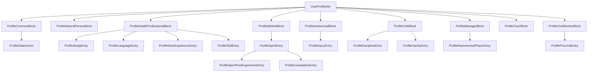

# Design Document

## Overview

This design defines a single, extensible TypeScript data-shape (`UserProfileDto`) for the Sora Sport application. The DTO groups every profile persona type (natural person, health professional, athlete, anatomical/clinical, club, manager, tutor, club worker) into one root interface where each persona is an **optional** block property.

The artifact is intentionally a throwaway mock for testing. It contains **data shapes only** — interfaces and type aliases. There are no classes, no validation, no logic, no mock data, and no runtime constants. It lives in a new file and neither imports nor modifies the existing models.

Design goals, in priority order:

1. **Isolation** — no collision with, and no dependency on, existing exported types (Req 2).
2. **Extensibility** — new optional fields can be added to any block later without breaking previously valid instances (Req 14).
3. **Simplicity** — the smallest structure that satisfies the requirements, since the artifact will be deleted later.

### Key Design Decisions

| Decision | Rationale | Requirement |
|---|---|---|
| One root interface, one optional property per persona | Any persona can be mocked from a single type without unions | 1.2, 14.1 |
| Every block and every array element is its own named interface | New fields land in a small, isolated interface; nothing else changes | 14.1, 14.2 |
| All persona blocks optional; most nested fields optional | Omitting a block/field stays assignable | 1.2, 14.3 |
| Type names prefixed to stay unique | Avoids collision with existing exports (`Club`, `Division`, `UserProfile`, etc.) | 2.1 |
| New file, no imports from existing models | Deletable with zero side effects | 2.2, 2.3 |
| Catalog FKs typed `string` / `string[]` with `Id`/`Ids` suffix + comment | Backend catalogs are not yet defined; suffix + comment document the pending reference | 3.2, 3.3, 3.4 |
| Single shared attachment type | One shape for every uploaded file | 4.1 |
| Sport-dependent lists modeled as types only | No literals/mock data now; real loading comes later | 8.5, 14.4 |
| Incomplete blocks marked with `pending` comments | Source list is not final | 1.4, 9.2, 13.2 |

## Architecture

This is a leaf data module. There is no runtime architecture — no services, no injection, no I/O. The "architecture" is the type composition tree: one root interface referencing named block interfaces, each of which may reference named nested-array-element interfaces.



### File / Module Structure

- **File (new):** `src/app/core/models/user-profile-dto.model.ts`
- **Imports:** none. The file must not import `user.model.ts`, `club.model.ts`, or any other existing model (Req 2.3).
- **Exports:** the root `UserProfileDto` interface, the shared `ProfileAttachment` type, every block interface, every nested-array-element interface, and the sport-dependent list types.

**Naming conventions** (matching the project):

- Interfaces and type aliases: `PascalCase`.
- Fields: `camelCase`.
- Entity id: `id: string`.
- Optional fields use the `?` modifier.
- Inline `//` comments document pending types, catalog references, conditional dependencies, and visibility notes.
- All identifiers and comments in English only (Req 1.3).

**Collision avoidance** (Req 2.1): existing exports in `src/app/core/models/` include `UserProfile`, `AthleteProfile`, `HealthProfessionalProfile`, `Club`, `Division`, `StaffRecommendation`, `Convocatoria`, `MarketplaceCard`, `Item`, `Task`, `TaskAssignment`, and others. Every type introduced here is prefixed (`UserProfileDto`, `Profile*`) so no name is reused. Notably the root is `UserProfileDto` (not `UserProfile`), and the club block is `ProfileClubBlock` (not `Club`).

## Components and Interfaces

The module is organized as one root interface plus grouped block interfaces. This section describes the shape and intent of each; the concrete field list is in **Data Models**.

### Root

- **`UserProfileDto`** — the single root (Req 1.1). Declares the entity `id: string` (Req 3.1) and one **optional** property per persona block (Req 1.2). No methods, no statements (Req 1.5).

### Shared type

- **`ProfileAttachment`** — one shape used by every "file" field (Req 4.1, 4.3). Kept minimal and additive-friendly.

### Persona blocks

- **`ProfileCommonBlock`** — shared identity/contact data (Req 5).
- **`ProfileNaturalPersonBlock`** — non-professional individual data (Req 6).
- **`ProfileHealthProfessionalBlock`** — credentials + nested studies, languages, work experience, skills (Req 7).
- **`ProfileAthleteBlock`** — sports array; each sport carries prior experience and competitions (Req 8).
- **`ProfileAnatomicalBlock`** — physical/medical data; incomplete, all optional, marked pending (Req 9).
- **`ProfileClubBlock`** — club identity + disciplines and facilities (Req 10).
- **`ProfileManagerBlock`** — represented-player data (Req 11).
- **`ProfileTutorBlock`** — legal-guardian verification attachment (Req 12).
- **`ProfileClubWorkerBlock`** — staff data + prior jobs (incomplete, pending) (Req 13).

### Nested array-element interfaces

Each array element is its own named interface, even when nearly empty (Req 14.2): `ProfileStudyEntry`, `ProfileLanguageEntry`, `ProfileWorkExperienceEntry`, `ProfileSkillEntry`, `ProfileSportEntry`, `ProfileSportPriorExperienceEntry`, `ProfileCompetitionEntry`, `ProfileInjuryEntry`, `ProfileDisciplineEntry`, `ProfileFacilityEntry`, `ProfileRepresentedPlayerEntry`, `ProfilePriorJobEntry`.

### Sport-dependent list types

- **`ProfileAthleteLevel`** — union type (`'amateur' | 'elite' | 'professional'`) for athlete level (Req 8.2).

Category and position lists vary by sport and are modeled as **Catalog FKs only** (`string` / `string[]`), not as enumerated types with literals (Req 8.5, 14.4). No exported constant instances exist for them.

## Data Models

The concrete TypeScript for the module. This is the design target for implementation; it is data shapes only.

```typescript
// src/app/core/models/user-profile-dto.model.ts
//
// Throwaway mock DTO for profile data. Data shapes only — no logic, no
// validation, no classes, no mock values. Does not import or modify existing
// models. Intended to be deleted later.

// ---------------------------------------------------------------------------
// Shared types
// ---------------------------------------------------------------------------

/** A single uploaded file/document (ID photo, diploma, certificate, ...). Req 4 */
export interface ProfileAttachment {
  fileName: string;
  url: string;       // reference to the stored file
  mimeType?: string; // pending: attachment metadata not finalized
}

/** Athlete level. Req 8.2 */
export type ProfileAthleteLevel = 'amateur' | 'elite' | 'professional';

// ---------------------------------------------------------------------------
// Root
// ---------------------------------------------------------------------------

/**
 * Single root profile DTO. Each persona block is optional so any persona can be
 * mocked in isolation. Req 1.1, 1.2, 14.1
 */
export interface UserProfileDto {
  id: string; // Entity Id — the profile's own primary identifier. Req 3.1

  common?: ProfileCommonBlock;
  naturalPerson?: ProfileNaturalPersonBlock;
  healthProfessional?: ProfileHealthProfessionalBlock;
  athlete?: ProfileAthleteBlock;
  anatomical?: ProfileAnatomicalBlock;
  club?: ProfileClubBlock;
  manager?: ProfileManagerBlock;
  tutor?: ProfileTutorBlock;
  clubWorker?: ProfileClubWorkerBlock;
}

// ---------------------------------------------------------------------------
// Common block. Req 5
// ---------------------------------------------------------------------------

export interface ProfileCommonBlock {
  visibleInMarketplace?: boolean; // optional: only relevant for marketplace visibility. Req 5.4

  profilePhoto: ProfileAttachment;
  email: string;
  firstName: string;
  lastName: string;
  birthDate: Date; // Req 5.3
  identityDocumentNumber: string;
  documentTypeId: string;  // Catalog FK — pending backend "document type" catalog. Req 3.2
  idCardVerification: ProfileAttachment; // required verification photo. Req 4.2
  nationalityId: string;   // Catalog FK — pending backend "nationality" catalog
  sexId: string;           // Catalog FK — pending backend "sex" catalog
  personTypeId: string;    // Catalog FK — pending backend "person type" catalog

  address?: string;
  postalCode?: string;
  city?: string;
  province?: string;
  country?: string;
  phone?: string;
}

// ---------------------------------------------------------------------------
// Natural person block. Req 6
// ---------------------------------------------------------------------------

export interface ProfileNaturalPersonBlock {
  sportsPracticed?: string[];
  hobbies?: string[];
  isAmateurSports?: boolean; // Req 6.2
}

// ---------------------------------------------------------------------------
// Health professional block. Req 7
// ---------------------------------------------------------------------------

export interface ProfileHealthProfessionalBlock {
  worksRemotely?: boolean; // Req 7.2
  isLicensed: boolean;     // required. Req 7.2
  licenseId?: string;      // Catalog FK — pending backend "license" catalog; only when isLicensed is true. Req 3.2, 7.3
  professionTypeId?: string; // Catalog FK — pending backend "profession type" catalog. Req 3.2
  studyInstitution?: string;
  graduationDate?: Date;

  studies?: ProfileStudyEntry[];
  languages?: ProfileLanguageEntry[];
  workExperience?: ProfileWorkExperienceEntry[];
  skills?: ProfileSkillEntry[];
}

/** One study entry. Req 7.4 */
export interface ProfileStudyEntry {
  studyLevelId: string; // required. Catalog FK — pending backend "study level" catalog. Req 3.2
  graduationYear?: number;
  obtainedDegree?: string;
  average?: number;
  degree?: ProfileAttachment;
}

/** One language entry. Req 7.5 */
export interface ProfileLanguageEntry {
  language?: string;
  level?: string;
  institution?: string;
  graduationYear?: number;
  certificate?: ProfileAttachment;
}

/** One work-experience entry. Req 7.6 */
export interface ProfileWorkExperienceEntry {
  workplace?: string;
  startDate?: Date;
  endDate?: Date;
  currentlyWorking?: boolean;
  referenceContact?: string;
  position?: string;
  additionalDetails?: string;
}

/** One skill entry. Req 7.7 */
export interface ProfileSkillEntry {
  skillType?: string;
  additionalDetails?: string;
}

// ---------------------------------------------------------------------------
// Athlete block. Req 8
// ---------------------------------------------------------------------------

export interface ProfileAthleteBlock {
  sports?: ProfileSportEntry[];
}

/** One sport the athlete practices. Req 8.2 */
export interface ProfileSportEntry {
  sportType?: string;
  personalRecord?: string;
  categoryId?: string;         // Catalog FK — sport-dependent; pending backend "category" catalog. Req 8.5
  naturalPositionIds?: string[]; // Catalog FK[] — sport-dependent; pending backend "position" catalog. Req 3.3, 8.5
  level?: ProfileAthleteLevel;
  currentClub?: string;
  entryDate?: Date;

  priorExperience?: ProfileSportPriorExperienceEntry[];
  competitions?: ProfileCompetitionEntry[];
}

/** One prior-experience entry for a sport. Req 8.3 */
export interface ProfileSportPriorExperienceEntry {
  club?: string;
  positionIds?: string[]; // Catalog FK[] — sport-dependent; pending backend "position" catalog. Req 3.3, 8.5
  entryDate?: Date;
  exitDate?: Date;
  details?: string;
}

/** One competition entry for a sport. Req 8.4 */
export interface ProfileCompetitionEntry {
  tournament?: string;
  year?: number;
  tournamentPosition?: string;
  achievementIds?: string[]; // Catalog FK[] — pending backend "achievement" catalog. Req 3.3
  details?: string;
}

// ---------------------------------------------------------------------------
// Anatomical / clinical block. Incomplete — all optional, pending. Req 9
// ---------------------------------------------------------------------------

/** pending: anatomical/clinical block is incomplete; fields will be added later. Req 9.2 */
export interface ProfileAnatomicalBlock {
  weight?: number;
  height?: number;
  bloodGroup?: string;
  anthropometry?: string;
  somatotypeId?: string; // Catalog FK — pending backend "somatotype" catalog. Req 3.2
  clinicalHistory?: string;
  injuries?: ProfileInjuryEntry[];
  medicalRestrictions?: string;
}

/** One injury entry. pending: shape incomplete. Req 9.1 */
export interface ProfileInjuryEntry {
  description?: string; // pending: injury fields not finalized
}

// ---------------------------------------------------------------------------
// Club block. Req 10
// ---------------------------------------------------------------------------

export interface ProfileClubBlock {
  name?: string;
  legalName?: string;
  foundingYear?: number;
  location?: string;
  phone?: string;
  socialLinks?: string[];

  disciplines?: ProfileDisciplineEntry[];
  facilities?: ProfileFacilityEntry[];
}

/** One discipline the club offers. Req 10.2 */
export interface ProfileDisciplineEntry {
  disciplineName?: string;
  categoryIds?: string[]; // Catalog FK[] — pending backend "category" catalog. Req 3.3
}

/** One club facility. Req 10.3 */
export interface ProfileFacilityEntry {
  name?: string;
  typeIds?: string[]; // Catalog FK[] — pending backend "facility type" catalog. Req 3.3
  location?: string;
  phoneNumber?: string;
  internalDetails?: string; // club-internal visibility only. Req 10.3
}

// ---------------------------------------------------------------------------
// Manager block. Req 11
// ---------------------------------------------------------------------------

export interface ProfileManagerBlock {
  representedPlayerCount?: number;
  mainDiscipline?: string;
  representedPlayers?: ProfileRepresentedPlayerEntry[];
}

/** One represented player. Req 11.2 */
export interface ProfileRepresentedPlayerEntry {
  firstName?: string;
  lastName?: string;
  currentClub?: string;
}

// ---------------------------------------------------------------------------
// Tutor block. Req 12
// ---------------------------------------------------------------------------

export interface ProfileTutorBlock {
  legalGuardianVerification?: ProfileAttachment; // Req 12.1
}

// ---------------------------------------------------------------------------
// Club worker block. Req 13
// ---------------------------------------------------------------------------

export interface ProfileClubWorkerBlock {
  firstName?: string;
  lastName?: string;
  workArea?: string;
  position?: string;
  workPerformed?: string;
  contactNumber?: string;

  priorJobs?: ProfilePriorJobEntry[];
}

/** One prior job. pending: prior-jobs block is incomplete; fields will be added later. Req 13.2 */
export interface ProfilePriorJobEntry {
  description?: string; // pending: prior-job fields not finalized
}
```

### Id / Catalog-FK typing conventions

| Kind | Type | Suffix | Comment | Requirement |
|---|---|---|---|---|
| Entity id | `string` | `id` (exact) | none needed | 3.1 |
| Single catalog FK | `string` | `...Id` | inline comment naming the pending backend catalog | 3.2, 3.4 |
| Multiple catalog FK ("array id") | `string[]` | `...Ids` | inline comment naming the pending backend catalog | 3.3, 3.4 |

Any source field marked "id" that lacked the suffix is renamed to carry `Id`/`Ids` (Req 3.5). Sport-dependent catalog FKs (category, position) additionally note their sport-dependent nature (Req 8.5).

## Correctness Properties

*A property is a characteristic or behavior that should hold true across all valid executions of a system — essentially, a formal statement about what the system should do. Properties serve as the bridge between human-readable specifications and machine-verifiable correctness guarantees.*

**Scope note.** This feature is pure data-shape modeling: TypeScript interfaces and type aliases with no runtime behavior, no functions, no I/O. Classic runtime property-based testing does not apply — there is nothing to execute. The invariants that matter here are **type-level (compile-time) invariants**, verified by the TypeScript compiler through type-only assertion files (e.g., minimal-instance assignability checks and "expect-error" checks). Each property below is universally quantified over the relevant set of types/fields and is checkable by the compiler rather than by a runtime PBT library. See Testing Strategy for how these are executed.

### Property 1: Minimal-instance assignability

*For all* persona blocks and *for all* optional fields, an instance that supplies only the required fields (and omits every optional block and optional field) is assignable to its interface without a type error. In particular, `{ id: string }` is assignable to `UserProfileDto`, and an empty object `{}` is assignable to `ProfileAnatomicalBlock` and to `ProfilePriorJobEntry`.

**Validates: Requirements 1.2, 9.2, 13.2, 14.3**

### Property 2: Additive optional field preserves assignability

*For all* block or nested-array interfaces `I`, adding a new **optional** field to `I` leaves every instance that was previously assignable to `I` still assignable, and requires no modification to any other interface. Equivalently, the original shape remains a valid instance of the extended shape.

**Validates: Requirements 14.5**

### Property 3: Shared attachment typing

*For all* fields representing an uploaded file (`profilePhoto`, `idCardVerification`, `degree`, `certificate`, `legalGuardianVerification`), the field's type is exactly the shared `ProfileAttachment` type; any value assignable to one attachment field is assignable to every other attachment field of the same optionality.

**Validates: Requirements 4.1, 4.2, 4.3**

### Property 4: No name collision with existing exports

*For all* type names exported by `user-profile-dto.model.ts`, the name is distinct from every type/const name exported elsewhere in `src/app/core/models/`. Importing all names from both the new module and the existing modules into one scope produces no duplicate-identifier error.

**Validates: Requirements 2.1**

### Property 5: Isolation from existing models

*For all* import statements in `user-profile-dto.model.ts`, none references an existing model module, and no interface in the module `extends` `UserProfile`, `AthleteProfile`, or `Club`. The module compiles standalone.

**Validates: Requirements 2.3**

### Property 6: Sport-dependent lists are type-only

*For all* sport-dependent list references (category, position), the reference is a Catalog FK typed as `string` or `string[]` (or the `ProfileAthleteLevel` type alias), and the module exports no runtime constant, literal array, or initializer for these lists.

**Validates: Requirements 8.5, 14.4**

## Error Handling

There is no runtime error handling: the module contains no executable code (Req 1.5). All "errors" for this artifact are **compile-time type errors** surfaced by the TypeScript compiler:

- Assigning a value of the wrong type to a field (e.g., a non-`ProfileAttachment` to an attachment field) is a compile error.
- Omitting a required field (e.g., `idCardVerification` in `ProfileCommonBlock`, `isLicensed` in `ProfileHealthProfessionalBlock`, `id` on the root) is a compile error.
- A name collision with an existing export, if both were imported into one scope, is a duplicate-identifier compile error.

No try/catch, no validation, no defensive code is introduced. Runtime validation (if ever needed) is explicitly out of scope for this throwaway DTO.

## Testing Strategy

**Why not property-based testing.** PBT is not appropriate here: the artifact is declarative type definitions with no runtime behavior to exercise across generated inputs. There is no function to call and no output to assert. Introducing a runtime PBT library would add no value.

**What replaces it: type-level assertion checks.** The correctness properties above are verified at compile time using type-only test files (no runtime assertions, no test runner execution needed beyond `tsc`). These are lightweight and match the throwaway nature of the artifact.

Recommended checks (all compile-time):

1. **Minimal-instance assignability (Property 1)** — a `*.type-test.ts` file that constructs minimal instances:
   - `const root: UserProfileDto = { id: 'x' };` compiles.
   - `const ana: ProfileAnatomicalBlock = {};` and `const job: ProfilePriorJobEntry = {};` compile.
   - Each block constructed with only its required fields compiles.

2. **Required-field enforcement** — `@ts-expect-error` checks that omitting `id`, `idCardVerification`, or `isLicensed` fails to compile.

3. **Additive-field preservation (Property 2)** — declare a local interface extending a block with one extra optional field; assert the original instance is still assignable. Confirms extensibility without touching other interfaces.

4. **Attachment typing (Property 3)** — assign one `ProfileAttachment` value across all attachment-typed fields; all compile.

5. **No collision (Property 4)** — a check file that does `import * as dto from './user-profile-dto.model'` alongside imports from `user.model`, `club.model`, etc.; compiles with no duplicate-identifier error.

6. **Isolation (Property 5)** — inspection/lint that the module has zero imports from other model files; the module compiles standalone.

7. **Type-only sport lists (Property 6)** — inspection/lint that no runtime constant is exported for category/position lists (module exports only interfaces and type aliases).

**Execution.** These checks run as part of the normal Angular/TypeScript build (`ng build` / `tsc`), or as a dedicated `tsc --noEmit` over the type-test file. No unit-test runner is strictly required, though the type-test file may live under a `*.spec.ts` that simply imports the assertions so the CI build compiles it.

**Note.** Given the artifact is a throwaway mock intended for deletion, the minimum viable verification is that the module and a single minimal-instance type-test file compile under the project's existing `tsc` configuration.

## Requirements Coverage

| Requirement | Addressed by |
|---|---|
| 1 Single root DTO | `UserProfileDto`, Data Models, Property 1 |
| 2 Non-interference | File/Module Structure, Properties 4 & 5 |
| 3 Id / FK typing | Id/Catalog-FK conventions table, Data Models comments |
| 4 Attachments | `ProfileAttachment`, Property 3 |
| 5 Common block | `ProfileCommonBlock` |
| 6 Natural person | `ProfileNaturalPersonBlock` |
| 7 Health professional | `ProfileHealthProfessionalBlock` + nested entries |
| 8 Athlete | `ProfileAthleteBlock` + `ProfileSportEntry` + nested, Property 6 |
| 9 Anatomical/clinical | `ProfileAnatomicalBlock` (pending), Property 1 |
| 10 Club | `ProfileClubBlock` + disciplines/facilities |
| 11 Manager | `ProfileManagerBlock` + represented players |
| 12 Tutor | `ProfileTutorBlock` |
| 13 Club worker | `ProfileClubWorkerBlock` + prior jobs (pending), Property 1 |
| 14 Extensibility | Every block/entry a named interface, Properties 1, 2, 6 |
